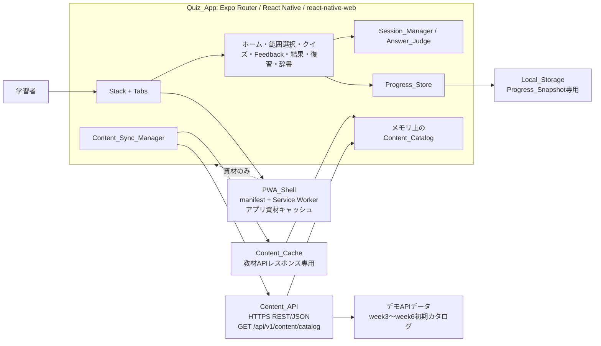
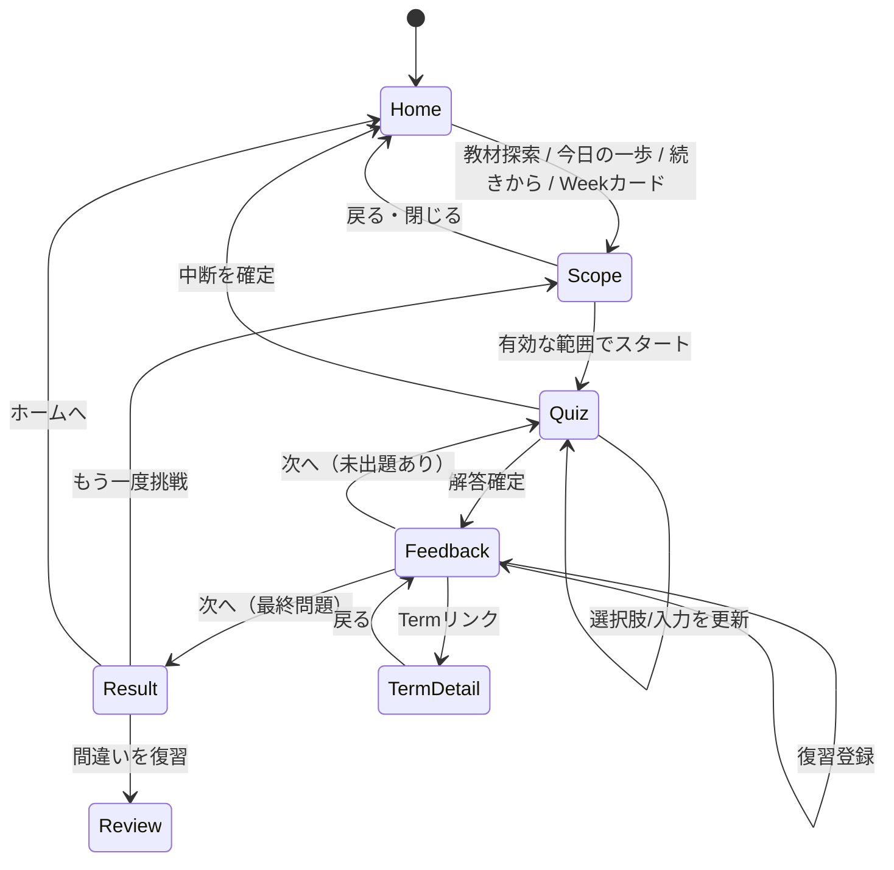

# curriculum-quiz-app 設計書

## Overview

### 1. 設計概要

### 1.1 目的と設計方針

本アプリは、POSSE week3〜week6 の教材に対応した短時間クイズ、即時フィードバック、誤答復習、用語辞書を、Expo SDK 54 の単一コードベースから Web（PWA）・iOS・Androidへ提供する。教材はアプリバンドルに含めず、認証なしの外部 `Content_API` から実行時に取得する。学習進捗は端末の`Local_Storage`だけに保存し、APIへ送信しない。

設計の中心原則は次のとおりである。

- **教材の信頼境界**: APIレスポンス全体を検証し、1項目でも契約違反があれば全体を利用しない。
- **可用性**: 正常な直近の`Content_Cache`がある場合は、API障害・タイムアウト・不正応答でもキャッシュで学習を継続する。
- **データ領域分離**: 教材キャッシュ、学習進捗、PWA資材キャッシュを別のキー・ライフサイクルで管理する。
- **セッション一貫性**: 更新中の教材が進行中のクイズへ混入しないよう、開始時に問題と表示順をスナップショットする。
- **純粋ロジックの分離**: 検証、出題範囲計算、判定、集計、JSON変換はI/Oから分離し、Property-Based Testing（PBT）で検証可能にする。
- **日本語・アクセシビリティ優先**: UI文言は日本語、コードや予約語は原文、キーボード・スクリーンリーダー・ダークモードを最初から設計対象とする。

### 1.2 構成図



`PWA_Shell`のService WorkerはHTML/JavaScript/CSS/画像等のアプリ資材だけを扱い、APIレスポンスの`Content_Cache`には触れない。`Content_Cache`はアプリ内のデータ同期層が扱い、`Progress_Snapshot`は`Progress_Store`だけが扱う。

### 1.3 採用技術と調査結果

- Expo SDK 54はReact Native 0.81、React 19.1、React Native Web 0.21を対応バージョンとし、プロジェクトの`package.json`（`expo ~54.0.36`、`expo-router ~6.0.24`）と整合する。参照: [Expo SDK 54公式リファレンス](https://docs.expo.dev/versions/v54.0.0/)。
- Expo Routerはファイルベースのルーティングで、`Stack`、`Tabs`、`Link`を提供する。既存の`app/(tabs)/index.tsx`、`app/(tabs)/explore.tsx`、`app/_layout.tsx`を維持し、テンプレートの表示内容を機能画面へ置き換える。参照: [Expo Router SDK 54公式リファレンス](https://docs.expo.dev/versions/v54.0.0/sdk/router/)。
- Expo SDKの環境設定は公開バンドルへ埋め込まれる値として扱い、API URLやAPIバージョンのみを`EXPO_PUBLIC_*`で切り替える。認証情報は設計・実装に持ち込まない。参照: [Expo SDK 54公式ドキュメント](https://docs.expo.dev/versions/v54.0.0/)。
- 教材の初期Source_Referenceは、`documents/week3.md`の「Week03｜Flexboxレイアウト」、`week4.md`の「Week04｜Gridレイアウト・擬似クラス」、`week5.md`の「Week05｜レスポンシブデザイン」、`week6.md`の「Week06｜JavaScript基礎（変数・型・条件分岐・関数）」など、実在する見出しをAPI側で登録する。教材Markdownをアプリ実行時に取得・解析することはしない。

## Architecture

### 2. Content_API契約

### 2.1 接続設定とエンドポイント

契約の例は次のとおりとする。

```text
GET {CONTENT_API_BASE_URL}/api/{API_VERSION}/content/catalog
例: GET https://content.example.test/api/v1/content/catalog
Accept: application/json
```

実行環境設定は次の公開値とする。

```text
EXPO_PUBLIC_CONTENT_API_BASE_URL=https://content.example.test
EXPO_PUBLIC_CONTENT_API_VERSION=v1
EXPO_PUBLIC_CONTENT_API_TIMEOUT_MS=8000
```

`Base URL`は開発・本番で切り替える。`API_VERSION`は`v1`のようなパス要素として組み立てる。APIは認証なしのデモAPIなので、トークン、Cookie、APIキー、Progress_Snapshotを送信しない。`EXPO_PUBLIC_*`に秘密情報を置かない。

接続タイムアウトは既定8秒とする。これは10秒以内の初期表示要件を妨げないよう、UIの初期化・キャッシュ読込とAPI更新確認を分離するためである。手動の「再試行」は同じtimeout、JSON解析、全体検証を再度適用する。自動リトライは初回表示を遅延させないため実施せず、ユーザー操作で再試行する。

### 2.2 レスポンスJSON例

```json
{
  "schemaVersion": 1,
  "contentVersion": "2025-10-01.1",
  "updatedAt": "2025-10-01T09:00:00.000Z",
  "catalog": {
    "weekUnits": [
      {
        "id": "week-unit-week3",
        "key": "week3",
        "order": 3,
        "title": "Week03｜Flexboxレイアウト",
        "published": true,
        "deleted": false
      }
    ],
    "questions": [
      {
        "id": "question-week3-justify-001",
        "weekUnitId": "week-unit-week3",
        "format": "singleChoice",
        "prompt": "主軸方向の配置を決めるプロパティはどれですか？",
        "payload": {
          "kind": "choice",
          "options": [
            { "id": "a", "text": "justify-content" },
            { "id": "b", "text": "align-items" },
            { "id": "c", "text": "display" },
            { "id": "d", "text": "position" }
          ],
          "correctOptionId": "a",
          "incorrectReasons": {
            "b": "align-itemsは交差軸方向を指定します。",
            "c": "displayはレイアウト方式を指定します。",
            "d": "positionは配置方法を指定します。"
          }
        },
        "explanation": "justify-contentはFlexコンテナの主軸方向における子要素の配置を決めます。align-itemsとは軸の向きが異なるため、まずflex-directionを確認します。",
        "sourceReference": {
          "weekKey": "week3",
          "sectionHeading": "3. justify-content：横方向の並び方を決める"
        },
        "published": true,
        "deleted": false
      },
      {
        "id": "question-week6-bmi-001",
        "weekUnitId": "week-unit-week6",
        "format": "fillBlank",
        "prompt": "空欄に入るキーワードを選んでください。",
        "payload": {
          "kind": "fillBlank",
          "content": "const bmi = (weight, height) => { return __BLANK__; }",
          "blankToken": "__BLANK__",
          "mode": "choice",
          "options": [
            { "id": "a", "text": "weight / (height * height)" },
            { "id": "b", "text": "weight + height" },
            { "id": "c", "text": "weight * height" },
            { "id": "d", "text": "height / weight" }
          ],
          "correctOptionId": "a"
        },
        "explanation": "BMIは体重を身長の二乗で割って求めます。関数の戻り値として式を返します。",
        "sourceReference": {
          "weekKey": "week6",
          "sectionHeading": "4. 関数"
        },
        "published": true,
        "deleted": false
      }
    ],
    "terms": [
      {
        "id": "term-week3-flexbox",
        "weekUnitId": "week-unit-week3",
        "name": "Flexbox",
        "definition": "親要素に指定して子要素を一方向に並べ、主軸と交差軸の配置を制御するCSSのレイアウト方式です。",
        "usageExamples": ["親にflexを指定してカードを横並びにします。"],
        "sourceReference": {
          "weekKey": "week3",
          "sectionHeading": "2. Flexboxの基本：「親」にflexをつける"
        },
        "relatedTermNames": ["justify-content", "align-items"],
        "published": true,
        "deleted": false
      }
    ]
  }
}
```

### 2.3 JSON型と契約制約

- `schemaVersion`: 1以上の整数。APIレスポンスの構造契約を識別する。
- `contentVersion`: 空白でない安定した文字列。同一値は同一教材スナップショットを表す。
- `updatedAt`: ISO 8601日時文字列。取得時刻ではなくAPI側の教材更新時刻とする。
- `catalog.weekUnits`: 初期データは`week3`、`week4`、`week5`、`week6`の4件。将来`week7`以降を含められるが、今回のUIの対象は4週だけ。
- すべての`id`はカタログ全体で一意なstable IDとし、教材の並び順変更で再利用しない。`id`の意味が別対象へ変更された応答は不正とする。
- `published`または`deleted`が付いたデータは、`deleted: true`または`published: false`なら出題・辞書表示対象から除外する。除外後に参照関係を評価する。
- 各Question_Itemは1件のWeek_Unitへ直接所属し、中間の階層を持たない。各週はactiveなQuestion_Itemを10〜60件持つ。
- 各週は「よくある間違い」を含むSource_Referenceの問題を2件以上持つ。ただし教材に該当節がない週は、バグ診断形式を2件以上持つことで代替する。さらに各週にはバグ診断1件以上、穴埋め1件以上を持つ。
- `QuestionItem.format`は`singleChoice`、`trueFalse`、`bugDiagnosis`、`fillBlank`のいずれか。`payload.kind`はformatと一致させる。
- 4択、バグ診断、候補選択穴埋めは選択肢4件、正誤は「正しい」「誤り」の2件をこの順で持ち、正解IDは必ず1件だけ存在する。選択肢文字列は相互に重複しない。
- バグ診断のコードは1〜20行、表示は等幅コードブロック、横長行はコードブロック内だけ横スクロールする。穴埋めは`blankToken`を1件だけ含む。自由入力穴埋めは正解文字列と最大64文字を持つ。
- `explanation`は空白を除いて20〜400文字。`sourceReference.weekKey`は所属週と一致し、`sectionHeading`は当該教材に実在する見出しと一致する。
- `TermEntry`は合計30件以上、各週5件以上。名前1〜40文字、説明20〜200文字、使用例1〜3件、Source_Reference 1件、関連用語名0〜5件。

### 2.4 HTTP応答・エラー契約

| 応答 | 扱い |
|---|---|
| `200 application/json` | JSON解析後、全体検証に成功した場合だけ採用 |
| `304 Not Modified` | 更新確認では再保存・メモリ切替なし。既存Cacheを維持 |
| `400/404` | API_Versionまたは契約設定エラーとしてSyncStateを`error`にし、Cacheへfallback |
| `408/504`、timeout | 取得失敗としてCacheへfallback |
| `429` | 取得失敗としてCacheへfallback。APIへProgressを送信しない |
| `500〜599` | サーバー障害としてCacheへfallback |
| JSON解析失敗、Content-Type不一致、契約違反 | 応答全体を不正として破棄し、Cacheへfallback |

Cacheがない初回取得失敗時は、クイズ・辞書を開始せず、日本語の教材取得エラー、詳細を開発者ログだけに残し、「再試行」操作を表示する。問題IDが特定できる検証エラー（Week_Unit不明、選択肢不正、stable ID意味変更）はそのIDを開発者ログへ出力するが、画面には内部情報を出さない。

## Data Models

### 3. TypeScriptデータモデル

実装では`types/content.ts`、`types/progress.ts`等に分割する。以下は契約の中心となる型である。

```ts
export type WeekKey = 'week3' | 'week4' | 'week5' | 'week6';
export type QuestionFormat = 'singleChoice' | 'trueFalse' | 'bugDiagnosis' | 'fillBlank';
export type SyncState =
  | 'uninitialized' | 'loading' | 'ready' | 'updated'
  | 'using-cache' | 'error';

export interface SourceReference {
  weekKey: string;
  sectionHeading: string;
}

export interface PublicationFields {
  published: boolean;
  deleted: boolean;
}

export interface WeekUnit extends PublicationFields {
  id: string;
  key: string;             // 初期値 week3〜week6
  order: number;
  title: string;
}

export interface ChoiceOption {
  id: string;
  text: string;
}

export interface ChoicePayload {
  kind: 'choice';
  options: ChoiceOption[];
  correctOptionId: string;
  incorrectReasons?: Record<string, string>;
}

export interface TrueFalsePayload {
  kind: 'trueFalse';
  options: [{ id: 'true'; text: '正しい' }, { id: 'false'; text: '誤り' }];
  correctOptionId: 'true' | 'false';
  incorrectReasons?: Partial<Record<'true' | 'false', string>>;
}

export interface BugDiagnosisPayload {
  kind: 'bugDiagnosis';
  code: string;
  options: ChoiceOption[];
  correctOptionId: string;
  incorrectReasons?: Record<string, string>;
}

export interface FillBlankChoicePayload {
  kind: 'fillBlank';
  content: string;
  blankToken: string;
  mode: 'choice';
  options: ChoiceOption[];
  correctOptionId: string;
  incorrectReasons?: Record<string, string>;
}

export interface FillBlankFreeTextPayload {
  kind: 'fillBlank';
  content: string;
  blankToken: string;
  mode: 'freeText';
  correctText: string;
  maxInputLength: 64;
}

export type QuestionPayload =
  | ChoicePayload | TrueFalsePayload | BugDiagnosisPayload
  | FillBlankChoicePayload | FillBlankFreeTextPayload;

export interface QuestionItem extends PublicationFields {
  id: string;
  weekUnitId: string;
  format: QuestionFormat;
  prompt: string;
  payload: QuestionPayload;
  explanation: string;
  sourceReference: SourceReference;
}

export interface TermEntry extends PublicationFields {
  id: string;
  weekUnitId: string;
  name: string;
  definition: string;
  usageExamples: string[];
  sourceReference: SourceReference;
  relatedTermNames: string[];
}

export interface ContentCatalog {
  weekUnits: WeekUnit[];
  questions: QuestionItem[];
  terms: TermEntry[];
}

export interface ApiResponse {
  schemaVersion: number;
  contentVersion: string;
  updatedAt: string;
  catalog: ContentCatalog;
}

export interface ContentCache {
  response: ApiResponse;
  cachedAt: string;
  apiVersion: string;
}
```

### 3.1 進捗モデル

```ts
export interface CountStats {
  questionCount: number;
  correctCount: number;
}

export interface WeekProgress extends CountStats {
  weekKey: WeekKey;
  lastAnsweredAt: string | null;
}

export interface ReviewEntry {
  questionId: string;
  weekKey: WeekKey;
  wrongCount: number;       // 1〜99
  consecutiveCorrect: number; // 0〜2
  lastWrongAt: string;
}

export interface ProgressSnapshot {
  schemaVersion: number;
  weekProgress: WeekProgress[];    // 対応教材ごとに1件
  reviewQueue: ReviewEntry[];      // 保存フォーマット上は0〜500件
  streakCount: number;             // 実行時0〜999。互換JSON入力は0〜9999を検証範囲とする
}
```

`ProgressStore`の実行時streakはRequirement 6に従い999で飽和させる。Requirement 9.7が定義するラウンドトリップ入力範囲（streak 0〜9999、Review_Queue 0〜500）は、保存フォーマットの互換検証範囲として扱う。通常の加算APIは999を超えず、Review Queueへの新規追加は200件を上限とする。これにより、通常利用の上限と保存形式のラウンドトリップ境界を混同しない。

### 3.2 セッション・回答モデル

```ts
export interface QuizSession {
  id: string;
  startedAt: string;
  questionIds: string[];       // 1回ずつ、重複なし
  questions: QuestionItem[];   // 開始時のimmutable snapshot
  optionOrders: Record<string, string[]>;
  currentIndex: number;
  answeredCount: number;
  correctCount: number;
  answers: Record<string, AnswerRecord>;
  mode: 'normal' | 'review' | 'termCheck';
}

export interface AnswerRecord {
  questionId: string;
  selectedOptionId?: string;
  freeText?: string;
  isCorrect: boolean;
  answeredAt: string;
}

export interface TermCheckQuestion {
  termId: string;
  options: string[]; // 正解の意味1件 + 他Termの意味3件
  correctIndex: number;
}
```

## Components and Interfaces

### 4. アプリ構成と画面遷移

### 4.1 既存Routerを活用したルート

既存の`app/(tabs)/index.tsx`をホーム、`app/(tabs)/explore.tsx`を辞書・その他導線のタブとして活用し、既存の`app/_layout.tsx`のStackと`app/(tabs)/_layout.tsx`のTabsを拡張する。テンプレートの英語説明、サンプルモーダル、静的画像は削除または機能に置き換える。

```text
app/
  _layout.tsx                    # ThemeProvider、Stack、PWA共通初期化
  (tabs)/
    _layout.tsx                  # ホーム/辞書（explore）のTab
    index.tsx                    # ホーム: 週一覧、進捗、同期状態
    explore.tsx                  # 用語辞書一覧・検索・用語確認
  scope/
    index.tsx                    # 週単位の出題範囲
  quiz/
    [sessionId].tsx              # 問題表示と回答
  feedback/
    [sessionId].tsx              # 問題内Feedback状態、Term遷移
  result/
    [sessionId].tsx              # 成績、再挑戦、復習、ホーム
  review.tsx                     # 復習キュー概要と復習開始
  term/[termId].tsx              # 用語詳細
  settings.tsx                   # 問題数、記録削除、同期再試行
```

ルート間で大きなデータをURLへ渡さず、`sessionId`と`termId`だけを渡す。Session本体は`QuizSessionStore`に保持する。FeedbackからTerm詳細へ移る場合は、Routerの戻り操作とSessionStoreの状態で問題番号、正解数、Feedback表示状態を復元する。

### 4.2 主要画面

1. **ホーム**: week3〜week6を週番号昇順で表示し、出題可能な問題件数、正答率または「未学習」、streak、`SyncState`を表示する。4週以外は表示しない。
2. **範囲選択**: 週単位と複数週横断の選択を提供し、選択週数と出題可能問題数を即時更新する。0件、横断週0件は開始不可にする。
3. **クイズ**: 3/5/10問または既定5問。問題番号、総数、正解数、形式別入力、44pt以上の操作領域を表示する。
4. **Feedback**: 問題文と同じ画面に「正解」「誤り」、正解内容、全文解説、出典（「引用：Week03「見出し」」の1行）、必要なら誤答理由、用語リンク、あいまい登録、次へを表示する。回答操作は無効化する。
5. **結果**: 正解数、総数、最初のQuestion_Item表示から最終Feedbackを閉じるまでの所要時間（分秒）、誤答したQuestion_Itemの重複なし一覧、全問正解表示、再挑戦・復習・ホームを表示する。
6. **復習**: 総件数とweek3〜week6別件数を表示し、誤答回数降順・最終誤答日時降順で開始する。0件なら開始不可。
7. **辞書**: 週番号昇順、週内用語名昇順、区分件数、1〜50文字の検索入力、trim・大小文字無視部分一致検索、Term詳細、関連用語遷移、5問確認セッションを提供する。

画面応答の性能予算は、ホームの週一覧を画面遷移から500ms以内、週選択後の出題可能件数表示を選択から500ms以内、開始後の最初のQuestion_Itemを1秒以内、判定とFeedback表示をそれぞれ1秒以内、Feedbackの「次へ」から次問または結果を1秒以内、Progress_Snapshot保存を判定表示後および結果表示後1秒以内、Progress復元を起動から2秒以内とする。PWA初期画面は対応ブラウザで10秒以内に操作可能、オフライン2回目以降の資材Cache起動は5秒以内、viewport区分変更・ダークモード変更は1秒以内とする。初回起動は認証を要求せず、教材利用可能なら1〜3回のLearner操作でSession開始可能にする。

### 5. APIクライアント、検証、同期、原子的切替

### 5.1 主要インターフェース

```ts
export interface ContentApiClient {
  fetchCatalog(signal?: AbortSignal): Promise<ApiResponse>;
}

export interface ContentCacheStore {
  read(): Promise<ContentCache | null>;
  writeAtomically(cache: ContentCache): Promise<void>;
  removePreviousAfterCommit(contentVersion: string): Promise<void>;
}

export interface ContentSyncManager {
  initialize(): Promise<void>;
  refresh(reason: 'startup' | 'manual' | 'background'): Promise<void>;
  getCatalog(): ContentCatalog | null;
  getState(): SyncState;
}

export function validateApiResponse(input: unknown):
  | { ok: true; response: ApiResponse }
  | { ok: false; issues: ValidationIssue[] };
```

`fetchCatalog`は`fetch`とAbortController（または同等のtimeout制御）を使い、HTTP、Content-Type、JSON解析を順に確認する。`validateApiResponse`は副作用を持たない。バリデータはactiveデータを対象に、ID、参照、数量、形式payload、Source_Reference、文章長、公開状態をすべて確認し、問題を部分採用しない。

### 5.2 起動・更新アルゴリズム

```text
initialize:
  1. ProgressStore.restore() と ContentCacheStore.read() を並行開始する
  2. cache が読み出せたら catalog = cache.response.catalog とし、UIをブロックせず表示する
  3. cache がなければ SyncState = loading と教材取得画面を表示する
  4. refresh('startup') をバックグラウンド開始する

refresh:
  1. SyncState = loading（既存catalogがあれば using-cache の表示を維持してよい）
  2. GET /api/{API_VERSION}/content/catalog を timeout=8秒で実行する
  3. HTTP/JSON/validateApiResponseを全体に適用する
  4. 失敗なら既存の正常cacheを保持し、cacheありは SyncState=using-cache、なしは error
  5. 成功し、apiVersion と contentVersion が現行cacheと同じなら再保存・再切替しない
  6. 成功し、新版なら一時キーへ全体を書き込む
  7. 書き込み完了と再読込検証が成功してから current pointer を新版へ切り替える
  8. pointer切替後に旧版データを削除し、memory catalogを新版へ置き換える
  9. SyncState = ready または updated としてUIへ通知する
```

`Content_Cache`は、例えば`content-cache:current`（現行ポインタ）と`content-cache:version:{contentVersion}`（一時・版別データ）を使う。Webは`localStorage`、ネイティブは同等のキー値ストア（実装時はAsyncStorage等のExpo対応アダプター）を使うが、抽象化した`ContentCacheStore`以外から直接アクセスしない。ポインタを最後に書くことで、途中書き込みを現行データと誤認しない。旧版削除に失敗しても新しいポインタとメモリは有効なままにする。

### 5.3 不正応答・stable ID検証

検証は次の段階で行う。

```text
validate(response):
  shape/meta -> active publication filter -> unique IDs
  -> week/question/term references
  -> per-format payload and answer cardinality
  -> source headings and explanation length
  -> per-week counts
  -> per-week bug/fill-blank/common-mistake coverage
  -> 30+ terms and 5+ terms per week
  -> return entire normalized catalog or all errors
```

API更新時は現行Catalogの`id -> entity fingerprint`（対象種別、週、名前など）を保持し、同じstable IDが別対象を表した場合は全体を拒否する。非公開・削除項目は表示対象から除外するが、既存Review QueueのIDが消えた場合は「利用不能な復習項目」として安全にスキップし、他の復習を継続する。

### 5.4 同期状態

- `uninitialized`: まだCache/APIを判定していない。
- `loading`: 初回または手動更新中。
- `ready`: APIから検証済みCatalogを利用中。
- `updated`: 新版への切替完了直後。
- `using-cache`: API失敗中だが正常Cacheで全機能を利用中。
- `error`: Cacheなしで教材を利用できず再試行が必要。

### 6. クイズ、フィードバック、復習、辞書、進捗の状態設計

### 6.1 クイズ生成と判定

```ts
export function normalizeQuestionCount(value: unknown): 3 | 5 | 10;
export function selectQuestionPool(
  catalog: ContentCatalog,
  scope: { weekKeys: string[] },
): QuestionItem[];
export function createQuizSession(
  pool: QuestionItem[],
  requestedCount: unknown,
  mode?: 'normal' | 'review',
  random?: RandomSource,
): QuizSession;
export function judgeAnswer(
  question: QuestionItem,
  answer: { optionId?: string; freeText?: string },
): { isCorrect: boolean; correctText: string; incorrectReason?: string };
export function normalizeFreeText(input: string): string;
```

`normalizeQuestionCount`は未設定・不正値を5にし、許可値3/5/10だけを通す。プールが1件以上で設定数未満なら全件を採用する。複数週では2〜4週だけを許可し、同一IDをSetで除去する。通常セッションで5問以上、かつ非4択問題がプールにある場合は、可能な限り最低1件を予約して残りを無作為抽出する。プール自体が不足する場合は存在する問題数を優先する。

4択・バグ診断・候補選択穴埋めの選択肢順は、Question IDとSession IDから生成したセッション内seedで初回表示時に決め、`optionOrders`へ保存する。同じ問題の再表示では保存順を使う。自由入力は先頭・末尾の半角空白、全角空白、タブ、改行を除去し、大文字小文字を区別して完全一致させる。空白だけ、または64文字超の入力は確定不可とする。

### 6.2 Feedbackと用語リンク

```ts
export function buildFeedback(
  question: QuestionItem,
  answer: AnswerRecord,
  catalog: ContentCatalog,
): FeedbackViewModel;
export function linkFirstTermOccurrences(
  explanation: string,
  terms: TermEntry[],
): Array<{ text: string; termId?: string }>;
export function addReviewOnAmbiguous(
  queue: ReviewEntry[], question: QuestionItem, now: string,
): ReviewEntry[];
```

用語名は英字大小文字を無視して完全一致し、各用語名の最初の出現箇所だけをTerm遷移可能にする。対応Termがなければ通常テキストにする。誤答理由が欠落していれば領域自体を表示しない。Feedback表示中は回答ボタンを無効化し、ライブリージョンで判定結果と正解を1回だけ通知する。

### 6.3 ProgressStore、Streak、Review Queue

```ts
export interface ProgressStore {
  restore(): Promise<RestoreResult>;
  recordAnswer(input: AnswerRecord & { weekKey: WeekKey }): Promise<void>;
  save(snapshot?: ProgressSnapshot): Promise<void>;
  serialize(snapshot: ProgressSnapshot): string;
  deserialize(json: string): ProgressSnapshot;
  reset(): Promise<void>;
}

export function updateStreak(current: number, isCorrect: boolean): number;
export function applyReviewAnswer(
  queue: ReviewEntry[], questionId: string, isCorrect: boolean, now: string,
): ReviewEntry[];
export function percentage(correct: number, total: number): number | null;
```

判定確定時に週の出題数を1増やし、正解なら正解数も1増やす。未解答は集計しない。判定結果表示後1秒以内にSnapshot保存を試み、失敗してもメモリ上の直前Snapshotを保持してセッションを継続し、既存Local_Storageを削除しない。

誤答は未登録なら`wrongCount=1`、`consecutiveCorrect=0`で登録する。既登録なら`wrongCount`を最大99まで加算し、件数を増やさない。復習正解は連続正解を1増やし、2に達したら除外する。復習誤答は連続正解を0、最終誤答日時を更新する。新規追加時に運用上200件に達していれば、最終誤答日時が最古の1件を除外してから追加する。

出題数0は`percentage`がnullになり、UIは「未学習」と表示する。

### 7. オフライン、PWA、アクセシビリティ、レスポンシブ、セキュリティ

### 7.1 オフライン

起動時にContent_Cacheがあれば、API更新確認中もそのCatalogを表示し、出題、判定、Feedback、辞書、Progress_Snapshotの読み書きを利用可能にする。APIへ接続できないことだけを理由に、教材利用や学習進捗を止めない。初回でCacheも資材Cacheもなければ、Service Workerは教材データを生成せず、オフライン案内と再試行を表示する。

Progressの復元不能、schemaVersion不一致、型・範囲不正は初期Snapshotへ戻し、「学習記録を初期化しました」を表示する。Snapshotが存在しない場合は無通知で初期化する。削除確認の取消しは保存内容を変えない。

### 7.2 PWA Shell

Webビルドではmanifestに次の6要素を定義する。

- 1〜30文字のアプリ名、1〜12文字の短縮名
- 192×192、512×512のアイコン
- `display: standalone`
- `theme_color`、`background_color`

Service WorkerはHTML、JavaScript、CSS、画像等のアプリ資材をキャッシュする。接続時は最新資材を次回起動用に更新し、API更新時は資材キャッシュを再配信せず、Content_Cacheだけを原子的に更新する。マニフェストまたはService Worker非対応ブラウザではインストール導線を出さず、通常タブで全機能を継続する。PWA資材CacheがAPI失敗で無効化されることはない。

### 7.3 レスポンシブとアクセシビリティ

- 320〜767pxは1カラム、横方向overflow 0px。
- 768〜1023pxは中間レイアウト。
- 1024px以上は最大幅960px、左右余白差8px以内で中央配置。
- Resizeは再読み込みなしで1秒以内に反映し、回答選択状態を保持する。
- すべての選択肢、ボタン、Tabに`accessibilityRole`と日本語`accessibilityLabel`を設定し、selected/disabled状態を渡す。
- 44pt×44pt以上のタップ領域と、隣接要素間8pt以上の間隔を確保する。
- 判定結果は色だけでなく異なる記号と「正解」「誤り」の日本語で表す。
- ライト/ダーク双方で通常文字4.5:1以上、大きい文字3:1以上、フォーカス表示3:1以上を満たす。
- `useColorScheme`で起動時と変更時の全画面配色を適用し、WebではTab、Enter、Space操作と可視フォーカスを提供する。

### 7.4 セキュリティとプライバシー

本デモは認証なしAPIのため、個人情報、メール、認証情報を要求しない。APIはHTTPSのみを許可し、`Content_API`には教材取得以外のPOST/PUTを実装しない。Progress、Review Queue、StreakはLocal_Storageに限定し、`fetch`のbody、query、headerへ含めない。開発ログには検証失敗の問題IDを出せるが、画面に内部URLやレスポンス全文を表示しない。キャッシュJSONは外部へ送信せず、Service Worker資材キャッシュと学習データ領域を分離する。

## Correctness Properties

### 8. Correctness Properties

この機能は、カタログ・セッション・判定・進捗の純粋な入出力が広い入力空間を持つためPBTを適用する。UIの見た目、ブラウザ、Service Worker、外部APIの実挙動はPBTの対象にせず、後述の例示・統合・スモークテストで検証する。

> A property is a characteristic or behavior that should hold true across all valid executions of a system—essentially, a formal statement about what the system should do. Properties serve as the bridge between human-readable specifications and machine-verifiable correctness guarantees.

### Property 1: 受理カタログは全契約制約を満たす

**For all** APIレスポンスが`validateApiResponse`で受理される場合、activeなweek/question/termのstable ID、参照関係、週別数量、形式別payload、解説長、Source_Reference、公開状態、必須形式・誤りやすい問題、Term数量のすべてがRequirements 1.3〜1.10、1.13〜1.15、4.7、8.1〜8.2を満たす。

**Validates: Requirements 1.3, 1.5, 1.6, 1.7, 1.8, 1.9, 1.10, 1.13, 1.14, 1.15, 4.7, 8.1, 8.2**

### Property 2: 不正レスポンスは全体拒否し、安全なfallbackへ分岐する

**For all** 1項目以上の契約違反を含むAPIレスポンスは、部分的なCatalogを返さず、正常Cacheがあればそれを維持し、なければ`error`と再試行可能状態になる。問題IDを持つ検証違反は開発者ログへ出力する。

**Validates: Requirements 1.11, 1.12, 1.15, 1.16, 9.19, 9.20, 12.5**

### Property 3: 同一バージョンは再保存・再切替しない

**For all** 現行Cacheと同じ`apiVersion`および`contentVersion`を持つ検証済みレスポンスは、Content_Cacheの保存回数、旧Catalogからの切替、メモリ参照を変化させない。

**Validates: Requirements 1.17, 9.21**

### Property 4: 新版切替は原子的である

**For all** 検証済みの新版レスポンスについて、保存が完了する前は現行Catalogが維持され、保存成功後にだけポインタとメモリCatalogが新版へ切り替わり、切替後に旧版を削除する。保存途中の失敗では旧版が利用可能なままである。

**Validates: Requirements 9.16, 9.18, 9.19**

### Property 5: 進行中Sessionは開始時の教材を保持する

**For all** セッション開始後にCatalogが新版へ更新されても、そのSessionのQuestion_Item、Source_Reference、解説、表示選択肢順は開始時スナップショットから変化せず、新版は次の範囲選択・新規Sessionから反映される。

**Validates: Requirements 9.22**

### Property 6: 出題範囲は選択条件だけを含み問題を重複させない

**For all** 有効な週選択と出題可能Catalogから生成したSessionは、選択された週に属するactive Question_Itemだけを含み、各Question IDを1回だけ含む。横断なら選択2〜4週を対象とする。

**Validates: Requirements 2.3, 2.4, 2.5, 3.4, 4.10**

### Property 7: 問題数設定は3/5/10へ正規化され不足時は全件を使う

**For all** 設定値が未設定または3/5/10以外なら5、設定値が有効ならその値を目標数とし、出題可能問題数が目標未満なら全件を採用する。生成Sessionの総数は1以上でプール数以下となる。

**Validates: Requirements 3.1, 3.2, 3.3, 3.10, 7.4**

### Property 8: 各Question_Formatのpayloadは一意な正解を持つ

**For all** 受理された4択、正誤、バグ診断、候補選択穴埋め問題は、形式で定めた選択肢数・順序・相互非重複・正解1件を満たし、穴埋めは空欄1件、バグ診断コードは1〜20行である。

**Validates: Requirements 4.2, 4.3, 4.4, 4.5, 4.11**

### Property 9: 選択肢順序はSession内で安定する

**For all** 同じQuiz Sessionで同じQuestion_Itemを複数回表示する場合、初回にseedから決定した選択肢順と再表示時の選択肢順は一致し、異なるSessionでは許される範囲で異なる順序を選べる。

**Validates: Requirements 4.8**

### Property 10: 自由入力判定はtrim後の大文字小文字区別完全一致である

**For all** 自由入力文字列は先頭末尾の半角空白、全角空白、タブ、改行だけを除去して正解文字列と比較し、大小文字を変更した文字列や空白以外の差分は一致しない。64文字超または空白のみは確定不可である。

**Validates: Requirements 4.6, 4.9, 4.12**

### Property 11: Feedbackの用語リンクは各用語の最初の一致だけをリンクする

**For all** 解説文字列とTerm集合について、Term名の英字大小文字無視完全一致が存在すれば各Termの最初の出現だけが対応IDを持ち、未登録語や後続出現は通常テキストになる。

**Validates: Requirements 5.7, 5.8**

### Property 12: Streak遷移は上限・リセットを守る

**For all** 実行時streak値0〜999に対し正解は1増加し999で飽和し、誤答は0になる。Sessionの開始・終了を挟んでも回答がない限り値は初期化されない。

**Validates: Requirements 6.1, 6.2, 6.9**

### Property 13: 進捗の正答率集計は境界を守る

**For all** 0以上の出題数と、出題数以下の正解数から計算した正答率は0〜100の整数（小数第1位四捨五入）となり、出題数0は未学習となる。

**Validates: Requirements 6.4, 6.5, 6.6, 6.7, 6.8, 6.10, 6.11**

### Property 14: Review Queue更新は冪等で上限を守る

**For all** 同じQuestion_Itemへのあいまい登録または誤答の再適用は登録件数を不必要に増やさず、誤答回数は最大99、復習誤答はstreakを0、復習正解は連続正解を1増加し2で除外する。新規追加が運用上200件を超える場合は最古1件を置換する。

**Validates: Requirements 5.9, 7.1, 7.2, 7.3, 7.5, 7.8, 7.9, 7.10, 8.9**

### Property 15: 復習Sessionは優先順と設定数を守る

**For all** Review Queueが空でない場合、復習Sessionは誤答回数降順、同率なら最終誤答日時の新しい順に並び、正規化された設定問題数を上限として重複なく生成する。

**Validates: Requirements 7.4**

### Property 16: ProgressSnapshotのJSONは完全なラウンドトリップになる

**For all** 要件で定義された有効なProgressSnapshot（週成績は対応教材件数分、Review Queue 0〜500件、streak 0〜9999、各出題数・正解数0〜99999かつ正解数≤出題数）について、serialize後にdeserializeした値とReview Queue順序は一致し、再serializeしたJSON文字列は初回と一致する。

**Validates: Requirements 9.5, 9.6, 9.7, 9.8**

### Property 17: Version更新とSyncStateの遷移は失敗時もデータを失わない

**For all** startup/manual更新の成功・timeout・HTTP失敗・検証失敗の系列について、成功新版では`loading -> updated/ready`、失敗かつCache有りでは`using-cache`、失敗かつCache無しでは`error`へ遷移し、正常Cacheと既存Progressは失われない。

**Validates: Requirements 9.17, 9.19, 9.26, 9.27**

## Error Handling

### 9. エラー処理

### 9.1 ユーザー向け

ユーザー向けメッセージは日本語で、内部のHTTPステータス、URL、問題ID、レスポンス全文を出さない。教材がCacheで利用できる場合は「オフライン／前回の教材を利用中」と表示し、学習を中断しない。Cacheがなければ「教材を取得できませんでした。通信を確認して再試行してください」と「再試行」を表示する。

入力エラーは、範囲未選択、出題可能問題0件、空白自由入力、用語不足、復習0件を画面上で説明し、直前の選択状態を保持する。保存失敗は「学習記録を保存できませんでした。学習は続けられます」と通知する。

### 9.2 開発者向け

検証エラーは構造化ログに`phase`、`contentVersion`、`entityType`、`entityId`、`issueCode`を記録する。個人情報や学習回答本文はログに含めない。APIの不正応答は1件の問題であってもレスポンス全体を破棄し、部分的な教材を利用しない。

### 9.3 進捗復元

JSON解析失敗、必須5項目の欠落、型・範囲不正、現行schemaVersionとの不一致（小さい場合・大きい場合の双方）は復元不能とする。初期Snapshotを生成して保存し、既存の不正データは復元対象に再利用しない。Local_Storage書込み失敗時はメモリ状態を保持し、既存値を先に削除しない。

## Testing Strategy

### 10. テスト戦略

### 10.1 テスト層

- **PBT（fast-check）**: Property 1〜17を対象に、各プロパティを単一のproperty testとして最低100回実行する。テストコメントは次の形式で設計プロパティを参照する。`Feature: curriculum-quiz-app, Property 16: ProgressSnapshotのJSONは完全なラウンドトリップになる`。
- **単体テスト（Vitest等）**: 具体的なweek3〜week6、各Question_Format、空白入力、境界値、全問正解、Review 0件、Term不足、削除取消しを確認する。
- **統合テスト**: APIクライアント、タイムアウト、HTTPエラー、Cache fallback、Local_Storageアダプター、Service Worker、Progress送信なし、Expo Router遷移をモックまたはブラウザで確認する。
- **E2E/アクセシビリティ**: Webでホーム→範囲→クイズ→Feedback→結果→復習、辞書検索・Term遷移、Tab/Enter/Space、ライブリージョン、focus可視性を確認する。
- **スモーク/ビルド**: manifestの6項目、資材CacheとContent_Cacheのキー分離、API URL設定、`expo export --platform web`、iOS/Android/Webの型・Lint・ビルドエラー0を確認する。

### 10.2 重点テストケース

1. 受理可能な最小カタログ（週問題10、Term各週5）と最大境界（週問題60、Term30以上）を検証する。
2. `explanation`の空白除外19/20/400/401文字、Source欠落、Week_Unit不明、format外、選択肢3/4/5件、正解0/1/2件を検証する。
3. week7をAPIから返し、取得は成功するがUI表示・出題・辞書分類から除外されることを確認する。
4. 同一contentVersionの再取得、新版の保存途中失敗、新版切替後の旧版削除、更新中Sessionの固定を検証する。
5. 問題数設定未設定、0、4、3、5、10、11、プール1/2/3/5/10件、横断週0/1/2/4/5件を検証する。
6. Review Queue 0/1/199/200件、誤答回数98/99、連続正解1/2、最古同時刻、Term確認の4件未満を検証する。
7. Snapshotのstreak 999/1000/9999、Review 200/500、JSONの欠落・型違い・未知schemaVersion、再シリアライズ文字列の一致を検証する。
8. 320/767/768/1023/1024px、選択状態を持ったままのresize、ライト/ダーク、44pt領域、キーボード操作、横スクロールコードを検証する。

### 10.3 データ生成器

fast-checkのジェネレータで、valid/invalid catalog、参照関係、公開状態、Question payload、Snapshot、Review Queue、Unicode空白、英字大小文字、問題数・週数境界を生成する。外部API・Local_Storage・時刻・乱数・Service Workerはアダプターをモックし、PBTは純粋な変換と状態遷移へ限定する。

## 11. 採用案・代替案・トレードオフ

| 論点 | 採用案 | 代替案 | トレードオフ |
|---|---|---|---|
| 教材配信 | 認証なしHTTPS REST/JSON Content_API | アプリ内JSON、教材Markdownの実行時パース | APIは差し替え可能だが通信・検証・Cache実装が必要。静的同梱は要件違反、Markdownパースは責務過多 |
| 状態管理 | React Context + reducer + 純粋ドメイン関数 | 外部状態管理ライブラリ | 依存を増やさずExpoテンプレートに適合。規模拡大時はStore境界を保ったまま置換できる |
| 永続化 | Web localStorage/nativeキー値ストアをアダプター化 | SQLite、IndexedDB専用実装 | 進捗・Cache量には十分。キー値ストアは複雑検索に弱いが、Snapshot一括保存で単純化できる |
| Cache更新 | 版別一時キー→ポインタ切替→旧版削除 | 直接上書き | 原子的切替により破損を防ぐ。旧版掃除の遅延は許容する |
| PWA | Expo Web出力にmanifest/Service Workerを追加 | ネイティブアプリのみ、第三者PWAラッパー | Web要件を満たすが、Service Workerのブラウザ差異を統合テストする必要がある |
| PBT | fast-check + Vitest、100回以上 | 手書きランダムテスト | 生成器の初期コストはあるが、境界・ラウンドトリップ・冪等性の回帰に強い |
| UI | React Native標準View/Pressable/Textと既存Themedコンポーネント | UIライブラリ | 依存とWeb/Native差異を抑えられる。コンポーネントのアクセシビリティ監査は自前で必要 |
| 同期 | 起動時Cacheを即表示、更新確認を非ブロック実行 | API取得完了までスプラッシュ維持 | オフライン起動と応答性に強い。新版反映タイミングをSyncStateで明示する必要がある |

## 12. Expo SDK 54を前提とした制約

- `package.json`のExpo SDK `~54.0.36`、Expo Router `~6.0.24`、React Native `0.81.5`、React `19.1.0`、React Native Web `~0.21.0`を維持し、SDK 54公式ドキュメントにないAPIや別SDKのサンプルを前提にしない。
- 既存のExpo Routerエントリ（`main: expo-router/entry`）、`app/_layout.tsx`のStack、`app/(tabs)/_layout.tsx`のTabsを利用する。Web・iOS・Androidでルート名とデータドメインを共有し、プラットフォーム固有処理はストレージ、PWA、キーボードなどのアダプターに閉じ込める。
- Expo SDK 54の対応表に従い、Node.jsは20.19.x以上を開発基準とする。依存を追加する場合はExpo SDK 54対応版を固定し、`npx expo install`相当で互換性を確認する。
- Expo Routerのファイルベース規約に従い、画面追加は`app/`配下、共有ロジックは`components/`、`hooks/`、`lib/`、`types/`等へ分離する。大きなJSONや教材本文を静的importしてアプリに固定しない。
- PWA manifestとService WorkerはWebターゲット専用にし、iOS/AndroidのランタイムへWeb APIを直接参照しない。`Platform`またはアダプターで分岐し、単一コードベースのビルドエラーを防ぐ。
- AGENTS.mdの指示どおり、実装時は必ず[Expo SDK 54公式ドキュメント](https://docs.expo.dev/versions/v54.0.0/)と該当SDK/Routerページを参照する。本設計はそのバージョン制約に基づくものであり、別バージョンのAPIを暗黙に採用しない。

以上の構成により、教材は動的APIから取得しながら、API障害時は教材Cacheで継続し、学習進捗は端末内に閉じたまま、短時間クイズ・復習・辞書・PWA配信・アクセシビリティを一貫したドメインモデルで実装できる。


---

## 13. 主要学習ループ UI/UX リファインメント設計

### 13.1 適用範囲

本節は、`uiux.md` の「POSSE Quiz 主要学習ループ UI/UX 契約」を実装へ落とし込むためのUI層補足である。対象画面はホーム、学習設定（既存の`app/scope/index.tsx`）、クイズ、Feedback、結果の5画面とする。

本節で変更するのは画面レイアウト、表示用コンポーネント、UI状態、画面間導線、テーマトークン、アクセシビリティ属性だけである。既存のContent_API、Content_Cache、Progress_Store、QuizSessionStore、Session_Manager、Answer_Judge、Review_Queue、ProgressSnapshotの契約・アルゴリズム・保存先・同期挙動は変更しない。UIは既存のドメイン関数とViewModelを読み取り、表示・操作結果を既存のアクションへ渡す。

下部固定ナビゲーション、学習データ画面、課金、ユーザー名、参考画像固有のキャラクター/教材画像は今回のUIリファインメント対象外とし、既存ルートを壊さず後続仕様で扱う。

### 13.2 UI構成とコンポーネント境界

```text
components/
  learning-loop/
    LearningSurface.tsx       # 画面背景、最大幅、safe area、スクロール境界
    LearningCard.tsx          # 白カード、角丸、余白、見出し/補助情報の共通構造
    LearningCta.tsx           # 主要/次点/テキストCTA、disabled、アクセシビリティ
    ProgressHeader.tsx        # 中断操作、問題番号、プログレスバー
    CountBadge.tsx            # 件数、正答率、未学習、状態ラベル
    ScopeChip.tsx             # Week/問題数チップ、件数、選択/無効状態
    FeedbackState.tsx         # 正解/誤りの記号、色、ラベル、正解内容
    SourceReferenceBlock.tsx  # Week表示名と教材見出しを1行で示す出典表示
    MetricCard.tsx            # 結果画面の主指標/補助指標
  home/
    TodayStepCard.tsx         # 今日の一歩
    ContinueCard.tsx          # 続きから。継続Sessionがある場合だけ表示
    WeekCard.tsx              # Week教材カード
    DiscoveryEntry.tsx        # 検索風探索導線、補助導線
  scope/
    ScopeSheet.tsx            # ボトムシート風の外枠とスクロール領域
    ScopeSelectionChips.tsx   # Week範囲チップ
    QuestionCountSelector.tsx # 3/5/10問選択
  quiz/
    QuestionCard.tsx          # 1問1カード
    ChoiceList.tsx            # 全幅選択肢と番号
    FreeTextAnswer.tsx        # 穴埋め自由入力
    CodeQuestionBlock.tsx     # バグ診断コードの局所横スクロール
  feedback/
    ExplanationCard.tsx       # 解説全文、Termリンク
    IncorrectReasonBlock.tsx  # 誤答理由が存在するときだけ表示
    ReviewAction.tsx          # あいまい/復習登録の状態
  result/
    CompletionHeader.tsx      # 学習完了の称賛
    ResultMetrics.tsx         # 主指標と補助指標
    ResultActions.tsx         # 再挑戦、復習、ホーム
```

既存の`ThemedView`、`ThemedText`、`constants/theme.ts`を利用し、画面ごとに色や角丸を直接定義しない。`LearningSurface`は320〜767px、768〜1023px、1024px以上のレイアウト区分、safe area、横overflow防止を共通化する。`LearningCard`は白面、角丸、余白、ダークモード時のsurface色を共通化する。

### 13.3 UI表示モデルと既存ドメインの接続

UI層では大きなドメインオブジェクトをRoute URLへ渡さず、既存設計どおり`sessionId`と`termId`だけを受け取る。各画面はContext/Storeまたは既存の純粋関数から表示用データを組み立てる。

```ts
interface HomeViewModel {
  discoveryLabel: string;
  todayStep: TodayStepViewModel | null;
  continuation: ContinuationViewModel | null;
  weeks: WeekCardViewModel[];
  syncState: SyncState;
  canStartLearning: boolean;
}

interface ScopeViewModel {
  selectedWeekKeys: string[];
  rangeChips: ScopeChipViewModel[];
  availableQuestionCount: number;
  selectedQuestionCount: 3 | 5 | 10;
  canStart: boolean;
  validationMessage?: string;
}

interface QuizViewModel {
  sessionId: string;
  currentNumber: number;
  total: number;
  correctCount: number;
  question: QuestionItem;
  optionOrder: string[];
  answerState: 'unanswered' | 'selected' | 'submitted';
  canSubmit: boolean;
}

interface FeedbackViewModel {
  status: 'correct' | 'incorrect';
  correctText: string;
  explanation: string;
  sourceReference: SourceReference;
  incorrectReason?: string;
  reviewState: 'available' | 'added' | 'unavailable';
  hasNextQuestion: boolean;
}

interface ResultViewModel {
  correctCount: number;
  total: number;
  elapsedSeconds: number;
  incorrectQuestionPrompts: string[];
  isPerfect: boolean;
  reviewCount: number;
  canReview: boolean;
}
```

これらはUI表示用の型であり、`QuestionItem`の検証、出題範囲計算、判定、Review Queue更新、Progress保存を再実装しない。たとえば`ScopeViewModel.canStart`は既存のscope/session生成ロジックが返す出題可能件数と選択状態から計算し、UIが独自にQuestion_Itemをフィルタしない。

### 13.4 画面状態と導線



今回対象の5画面以外への遷移は既存ルートを利用する。Term詳細とReview画面は既存機能を維持するための接続先としてのみ記載し、新しい画面設計タスクは追加しない。

#### Home

`ContentContext`と`ProgressContext`からWeekの表示用値、続きから情報、SyncStateを取得する。`DiscoveryEntry`、`TodayStepCard`、`ContinueCard`、`WeekCard`は、既存の範囲選択ルートへ`weekKeys`または既存の選択復元情報を渡す。Cache利用中は教材一覧をブロックせず、SyncStateを補助表示する。

#### Scope

`ScopeSheet`は既存のscope状態を表示し、Week選択、問題数選択、範囲の有効/無効表示を既存のSession生成入力へ接続する。開始CTAは常にシート下部に配置するが、`canStart`がfalseの場合はdisabledと理由表示にする。初期状態では有効なWeekと問題数5を選ぶ。

#### Quiz

`ProgressHeader`、`QuestionCard`、`ChoiceList`、`FreeTextAnswer`、`CodeQuestionBlock`をQuestion_Formatに応じて組み合わせる。選択肢順は`QuizSession.optionOrders`から読み、UIで再シャッフルしない。回答確定は既存`judgeAnswer`とSession更新アクションを呼び、成功後はFeedback表示状態へ遷移する。

#### Feedback

既存`buildFeedback`の結果を`FeedbackState`、`ExplanationCard`、`SourceReferenceBlock`、`IncorrectReasonBlock`へ分配する。誤答理由がない場合はコンポーネント自体を描画しない。復習登録は既存`addReviewOnAmbiguous`へ接続し、成功後はボタンを無効化する。Termリンクから離れて戻る場合は、既存SessionStoreの状態を変更せずFeedbackを復元する。

#### Result

既存Sessionの結果集計を`ResultMetrics`と`CompletionHeader`へ表示する。再挑戦は同一範囲・同一問題数の既存導線、復習はReview Queueの既存開始導線、ホームは既存ホームルートへ接続する。結果表示とProgress保存の競合を避けるため、画面は保存完了を待たずに表示する。

### 13.5 状態別表示契約

| UI状態 | 対象画面 | 表示/操作 |
|---|---|---|
| 初期化中 | ホーム | Skeletonまたは教材取得中表示。既存Cacheがあればカードを先に表示 |
| Cache利用中 | ホーム | Weekカードを表示し、補助ラベルで前回教材利用中を示す |
| 教材取得エラー | ホーム/設定 | 日本語エラー、再試行。範囲選択とクイズ開始は無効 |
| 範囲0件 | 学習設定 | 件数0、範囲チップ無効、理由、選択保持、開始不可 |
| 未回答 | クイズ | 選択肢/入力を有効、確定は入力条件を満たすまで無効 |
| 判定済み | Feedback | クイズ操作を無効、正誤・正解・解説・出典を表示 |
| 復習登録済み | Feedback | 受理済み表示、同じ問題への登録操作を無効 |
| Review 0件 | 結果 | 復習CTAを無効化し、理由を補助表示 |
| 保存失敗 | クイズ/Feedback/結果 | 既存の進行を続け、保存失敗メッセージを非ブロッキング表示 |

### 13.6 テーマ、アクセシビリティ、レスポンシブ境界

- `progressOrange`、`reviewBlue`、`growthGreen`、`supportGray`、`surfaceWhite`をテーマトークンとして定義し、前進/復習/成長/補助・無効の意味を5画面で統一する。
- 正解/誤り、選択中/未選択、登録済み/未登録は色だけでなく記号、日本語ラベル、`accessibilityState`で表現する。
- すべてのCTA、選択肢、チップ、Weekカードに適切な`accessibilityRole`と日本語`accessibilityLabel`を付け、選択中/無効状態を伝える。
- 44pt×44pt以上の操作領域、隣接8pt以上、WebのTab/Enter/Space、可視フォーカス、Feedbackの1回限りのライブリージョン通知を共通部品で担保する。
- クイズ中のコードだけを局所的に横スクロールさせ、5画面全体の水平overflowは0とする。Resize・ダークモード変更時にSession/入力状態を保持する。

### 13.7 実装上の非変更点

次の設計は本UIリファインメントでは変更しない。

- Content_APIのエンドポイント、API_Responseの検証、Content_Cacheの原子的更新、SyncStateの遷移
- Question_Itemの形式、選択肢順のSession固定、Answer_Judgeのtrim/大文字小文字規則
- FeedbackのTermリンク、Review_Queueの追加/更新/上限、ProgressSnapshotの保存・復元
- Expo SDK 54、Expo Routerの既存ルート契約、Web/iOS/Androidの単一コードベース
- 下部ナビゲーションと学習データ画面の後続対応方針
