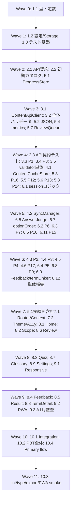

# Implementation Plan: curriculum-quiz-app

## Overview

requirements.md と design.md に基づき、Content_API を中心とした Expo SDK 54 / Expo Router / react-native-web アプリを、依存順に実装するためのタスク一覧である。教材カタログは実行時に認証なしの REST/JSON API から取得し、Content_Cache、Progress_Snapshot、PWA 資材キャッシュを別領域で管理する。実装言語は TypeScript とする。

すべてのタスクは、既存の `app/(tabs)/`、`components/themed-text.tsx`、`components/themed-view.tsx`、`constants/theme.ts` を土台にし、Expo SDK 54 の公式ドキュメントおよび Expo Router SDK 54 のファイルベース規約に従う。`AGENTS.md` の指示に従い、SDK 54 以外の API を前提にしない。

タスク内の `対象` は主な作成・変更対象、`完了条件` はコード生成エージェントが満たすべき検証可能な条件を示す。テストタスクは `*` を付けた任意タスクであるが、Property-Based Testing は設計上必須の検証範囲として明記する。

## Tasks

- [x] 1. 基盤、型、設定、テスト実行環境を整備する
  - [x] 1.1 TypeScript のドメイン型と定数を定義する
    - **対象:** `types/content.ts`、`types/progress.ts`、`types/session.ts`、`types/sync.ts`、`lib/constants.ts`
    - `WeekKey`、`QuestionFormat`、`ApiResponse`、`ContentCatalog`、公開状態、Source_Reference、Progress_Snapshot、ReviewEntry、QuizSession、SyncState など design.md の型を定義する。
    - `week3`〜`week6`、許可された問題形式、問題数 `3/5/10`、現行スキーマ版などを一元化する。
    - **依存:** なし
    - **完了条件:** API、ドメインロジック、UI が共有できる型が定義され、型チェックで未解決の型エラーがない。

  - [x] 1.2 実行環境設定とプラットフォーム別ストレージ境界を作る
    - **対象:** `lib/config.ts`、`lib/storage/StorageAdapter.ts`、`lib/storage/webStorage.ts`、`lib/storage/nativeStorage.ts`、必要な `app.json` / `app.config.*`
    - `EXPO_PUBLIC_CONTENT_API_BASE_URL`、`EXPO_PUBLIC_CONTENT_API_VERSION`、`EXPO_PUBLIC_CONTENT_API_TIMEOUT_MS` を読み取り、認証情報を扱わない設定 API を作る。
    - Web では `localStorage`、ネイティブでは Expo SDK 54 に適合するキー値ストアを使える抽象化を作り、後続の Content_Cache と Progress_Snapshot が直接プラットフォーム API に依存しないようにする。
    - **依存:** 1.1
    - **完了条件:** 開発用・本番用 Base URL と API_Version を切り替えられ、Content_API に認証情報や学習データを送らないストレージ境界が存在する。

  - [x] 1.3 Vitest、fast-check、React Native 向けテストの実行設定を追加する
    - **対象:** `package.json`、`vitest.config.*`、`tests/setup.*`、`tests/generators/*`
    - 設計書の Property 1〜17 を最低100回実行できる fast-check / Vitest の設定と、時刻・乱数・API・ストレージを差し替えるテストダブル基盤を用意する。
    - **依存:** 1.1
    - **完了条件:** 単体テストと PBT を単発実行でき、watch モードに依存しないテストコマンドが定義されている。

- [x] 2. Content_API のデモバックエンドと REST/JSON 契約を実装する
  - [x] 2.1 デモ用 Content_API のレスポンス型、エンドポイント、HTTP応答を作る
    - **対象:** `mock-api/` または `server/`、`mock-api/catalog.json`、`mock-api/routes/catalog.*`
    - `GET /api/{API_VERSION}/content/catalog`、`Accept: application/json`、`schemaVersion`、`contentVersion`、`updatedAt`、`catalog` の契約を実装する。
    - 認証なしで動作し、成功、304、400/404、408/504、429、500系、不正 JSON、Content-Type 不一致をテストから再現できる構造にする。
    - **対象要件:** 1.1、1.2、9.19、9.21、12.7
    - **依存:** 1.1、1.2
    - **完了条件:** 開発時にアプリから接続可能なモック API があり、学習データを受信する POST/PUT を持たない。

  - [x] 2.2 week3〜week6 の初期教材カタログを作成する
    - **対象:** `mock-api/catalog.json`、`mock-api/fixtures/*`、必要に応じて `scripts/validate-fixture.*`
    - week3、week4、week5、week6 の4週を含め、各週10〜60 Question_Item、各週5件以上の Term_Entry を用意する。
    - stable ID、教材上の出現順、実在する Source_Reference、20〜400文字の解説、各週の「よくある間違い」または代替バグ診断問題、バグ診断1件以上、穴埋め1件以上を含める。
    - 4択、正誤、バグ診断、候補選択穴埋め、自由入力穴埋めの payload と誤り理由を必要に応じて含める。
    - **対象要件:** 1.4〜1.10、1.14、4.7、8.1〜8.2、12.2、12.4
    - **依存:** 2.1
    - **完了条件:** 初期カタログが全体バリデータで受理され、教材 Markdown の実行時パースやアプリ内静的 import に依存しない。

  - [x] 2.3* API契約、初期カタログ、将来週の非表示を検証する単体テストを作る
    - **対象:** `tests/api/contract.test.ts`、`tests/api/catalog-fixture.test.ts`
    - week7 以降を API が返せる一方、今回の UI の表示・出題・辞書分類対象から除外されることを検証する。
    - **対象要件:** 1.4、1.18、9.24、12.6
    - **依存:** 2.2、3.1
    - **完了条件:** 初期4週の数量・形式・Source_Reference と将来週の取得可能だが非表示という契約が自動テストで確認できる。

- [x] 3. APIクライアントと Content_Catalog 全体バリデータを実装する
  - [x] 3.1 ContentApiClient と timeout / HTTP / JSON / Content-Type 処理を実装する
    - **対象:** `lib/content/ContentApiClient.ts`、`lib/content/http.ts`
    - 設定済み Base URL と API_Version からエンドポイントを組み立て、AbortController 等で既定8秒の timeout を適用する。
    - HTTP ステータス、Content-Type、JSON解析を順に検証し、認証情報、Progress_Snapshot、Review_Queue、Streak_Counterを送信しない。
    - **対象要件:** 1.2、1.16、9.19、9.27、12.3、12.8
    - **依存:** 1.1、1.2、2.1
    - **完了条件:** 成功時に `ApiResponse` を返し、timeout、HTTP失敗、JSON解析失敗、Content-Type不一致を呼び出し側が区別できる。

  - [x] 3.2 activeデータ、stable ID、参照関係、数量、形式 payload の全体バリデータを実装する
    - **対象:** `lib/content/validateApiResponse.ts`、`lib/content/validationIssues.ts`
    - schemaVersion、contentVersion、updatedAt、Week_Unit、Question_Item、Term_Entry の構造、active 公開状態、Content_Catalog 全体の一意 ID、参照関係、週別数量、Source_Reference、解説長、用語制約を検証する。
    - 非公開・削除済みは出題/辞書対象から除外するが、active データの参照整合性と必須数量を検証し、1件でも違反すれば部分採用しない。
    - Question_Format ごとの選択肢数、正解1件、正誤の順序、バグ診断コード行数、穴埋め空欄1件、週ごとの形式・誤りやすい問題を検証する。
    - **対象要件:** 1.3、1.5〜1.15、4.7、4.11、8.1〜8.2、12.5
    - **依存:** 1.1、2.2
    - **完了条件:** valid カタログだけが正規化済み `ContentCatalog` として返り、問題ID付きの構造化 `ValidationIssue` が返る。

  - [x] 3.3 Property 1: 受理カタログが全契約制約を満たすことを検証する
    - **対象:** `tests/property/contentCatalog.property.test.ts`、`tests/generators/catalog.ts`
    - **設計参照:** **Property 1: 受理カタログは全契約制約を満たす**
    - active ID、参照、数量、形式 payload、解説、Source_Reference、公開状態、必須形式、用語制約を生成データで検証する。
    - **Validates:** Requirements 1.3、1.5、1.6、1.7、1.8、1.9、1.10、1.13、1.14、1.15、4.7、8.1、8.2
    - **依存:** 3.2、1.3
    - **完了条件:** 生成した受理可能な全カタログで検証後の不変条件が成立し、最低100回の反復に成功する。

  - [x] 3.4 Property 8: Question_Format payload の正解一意性を検証する
    - **対象:** `tests/property/questionPayload.property.test.ts`
    - **設計参照:** **Property 8: 各Question_Formatのpayloadは一意な正解を持つ**
    - 4択、正誤、バグ診断、候補選択穴埋めの件数・順序・重複なし・正解1件、穴埋め空欄、バグコード行数を検証する。
    - **Validates:** Requirements 4.2〜4.5、4.11
    - **依存:** 3.2、1.3
    - **完了条件:** 形式ごとの valid/invalid payload を生成し、受理された payload が全条件を満たすことを最低100回確認できる。

  - [x] 3.5 全体拒否、問題IDログ、公開/削除フィルタの単体テストを作る
    - **対象:** `tests/content/validateApiResponse.test.ts`、`lib/content/logger.ts`
    - explanation の19/20/400/401文字、Source欠落、Week_Unit不明、format外、選択肢3/4/5件、正解0/1/2件、stable IDの意味変更を検証する。
    - **対象要件:** 1.9、1.11〜1.15、9.25、12.5
    - **依存:** 3.2
    - **完了条件:** 違反カタログが部分的に受理されず、問題IDを含む開発者向けログだけが出力され、画面向けエラーに内部情報が漏れない。

- [x] 4. Content_Cache、ContentSyncManager、失敗時 fallback を実装する
  - [x] 4.1 ContentCacheStore の版別保存、current pointer、原子的切替を実装する
    - **対象:** `lib/content/ContentCacheStore.ts`、`lib/storage/cacheKeys.ts`
    - `content-cache:current` と `content-cache:version:{contentVersion}` 等を使い、Progress_Snapshot と異なるキー領域で cache を管理する。
    - 一時キーへの保存・再読込検証・current pointer 切替・旧版削除の順に処理し、途中失敗時は旧版を残す。
    - **対象要件:** 9.16、9.18、9.23、10.11〜10.12
    - **依存:** 1.2、3.1
    - **完了条件:** 書き込み完了前に新版を現行と見なさず、旧版と Progress_Snapshot を破壊しない。

  - [x] 4.2 ContentSyncManager の起動、更新、同一版判定、SyncState 遷移を実装する
    - **対象:** `lib/content/ContentSyncManager.ts`、`contexts/ContentContext.tsx`、`hooks/useContentSync.ts`
    - ProgressStore.restore と Cache read を並行開始し、cache があれば UI をブロックせず表示しながら startup refresh を開始する。
    - 同一 API_Version と contentVersion は再保存・再切替せず、新版は atomic switch 後にメモリを切り替える。
    - 成功、更新済み、cache利用中、error、再試行を `SyncState` として公開し、API失敗時は正常 cache を保持する。
    - **対象要件:** 1.17、9.17〜9.22、9.26〜9.27、12.8
    - **依存:** 3.1、3.2、4.1、5.1
    - **完了条件:** 初回 cache なし失敗は再試行可能な error、cache あり失敗は using-cache、新版成功は updated/ready になり、UI操作を API 更新待ちでブロックしない。

  - [x] 4.3 Property 2: 不正レスポンスの全体拒否と fallback を検証する
    - **対象:** `tests/property/contentFallback.property.test.ts`
    - **設計参照:** **Property 2: 不正レスポンスは全体拒否し、安全なfallbackへ分岐する**
    - 1件以上の契約違反、timeout、HTTP/JSON失敗を生成し、正常 cache があれば維持し、なければ error と再試行状態になることを検証する。
    - **Validates:** Requirements 1.11、1.12、1.15、1.16、9.19、9.20、12.5
    - **依存:** 4.2、3.2、1.3
    - **完了条件:** 部分カタログがメモリや cache に入らず、問題ID付きログと適切な SyncState が確認できる。

  - [x] 4.4 Property 3: 同一 contentVersion の再保存・再切替回避を検証する
    - **対象:** `tests/property/contentVersionIdentity.property.test.ts`
    - **設計参照:** **Property 3: 同一バージョンは再保存・再切替しない**
    - 同一 API_Version と contentVersion の更新を与え、cache write 回数、旧Catalogからの切替、メモリ参照が変化しないことを検証する。
    - **Validates:** Requirements 1.17、9.21
    - **依存:** 4.2、4.1
    - **完了条件:** 同一版更新が再保存・再切替を発生させないことを最低100回確認できる。

  - [x] 4.5 Property 4: 新版の原子的切替を検証する
    - **対象:** `tests/property/contentAtomicSwitch.property.test.ts`
    - **設計参照:** **Property 4: 新版切替は原子的である**
    - 保存途中、再読込検証失敗、pointer 切替成功、旧版削除失敗を生成し、保存成功前は旧版を維持し、成功後だけ新版へ切り替えることを検証する。
    - **Validates:** Requirements 9.16、9.18、9.19
    - **依存:** 4.1、4.2
    - **完了条件:** 途中失敗で旧 Catalog と cache が利用可能なまま残り、成功時のみ pointer とメモリが新版になる。

  - [x] 4.6 Property 17: version更新と SyncState の失敗時データ保持を検証する
    - **対象:** `tests/property/syncState.property.test.ts`
    - **設計参照:** **Property 17: Version更新とSyncStateの遷移は失敗時もデータを失わない**
    - startup/manual 更新の成功、timeout、HTTP失敗、検証失敗を生成し、成功時の ready/updated、cacheあり失敗時の using-cache、cacheなし失敗時の error と既存 Progress の保持を検証する。
    - **Validates:** Requirements 9.17、9.19、9.26、9.27
    - **依存:** 4.2、5.1
    - **完了条件:** 全状態系列で正常 cache と Progress_Snapshot が消失せず、再試行が同じ timeout と検証規則を使う。

- [x] 5. ProgressStore、JSON永続化、Streak、Review Queue を実装する
  - [x] 5.1 ProgressStore の初期化、復元、回答記録、保存失敗、削除確認を実装する
    - **対象:** `lib/progress/ProgressStore.ts`、`lib/progress/progressDefaults.ts`、`contexts/ProgressContext.tsx`
    - 教材別の初期成績、Review_Queue、Streak、schemaVersion を作り、Local_Storage から起動時2秒以内に復元できる構造にする。
    - 欠落・型/範囲不正・schemaVersion不一致は初期化して保存し、日本語メッセージを出す。保存失敗時はメモリ状態と既存 Storage を保持し、セッションを継続する。
    - 削除確認は全成績、Review、Streak を初期化し、取消しでは Storage を変更しない。
    - **対象要件:** 3.9、3.12、6.4〜6.5、6.10、9.1〜9.4、9.8〜9.15
    - **依存:** 1.1、1.2
    - **完了条件:** Progress_Snapshot が Content_Cache と別キーで保存され、保存・復元・初期化・削除の結果が UI に通知される。

  - [x] 5.2 Progress_Snapshot の決定的 JSON serialize / deserialize を実装する
    - **対象:** `lib/progress/progressSerialization.ts`
    - 週別成績、Review_Queue の順序、Streak、schemaVersion の4項目を欠落なく直列化し、型・範囲・JSON構造を検証して復元する。v1（Topicあり）の保存データはTopic情報だけを捨ててv2へ移行する。
    - 未知/不正 JSON、必須項目欠落、現行版と異なる schemaVersion を復元不能として扱う。
    - **対象要件:** 9.5〜9.10
    - **依存:** 5.1
    - **完了条件:** 同じスナップショットから常に同じ JSON 文字列が生成され、不正入力が安全に拒否される。

  - [x] 5.3 Property 16: ProgressSnapshot JSON round-trip を検証する
    - **対象:** `tests/property/progressRoundTrip.property.test.ts`、`tests/generators/progress.ts`
    - **設計参照:** **Property 16: ProgressSnapshotのJSONは完全なラウンドトリップになる**
    - 要件範囲内の valid snapshot を生成し、serialize → deserialize の全項目・Review_Queue順序一致と再serialize文字列一致を検証する。
    - **Validates:** Requirements 9.5〜9.8
    - **依存:** 5.2、1.3
    - **完了条件:** streak 0〜9999、Review 0〜500、成績上限を含む生成値で最低100回成功する。

  - [x] 5.4 Streak と正答率の集計を実装する
    - **対象:** `lib/progress/streak.ts`、`lib/progress/metrics.ts`
    - 正解で最大999まで加算、誤答で0、セッション開始/終了では初期化しない。正答率は小数第1位四捨五入、出題数0は null とする。
    - **対象要件:** 6.1〜6.3、6.6〜6.11
    - **依存:** 5.1
    - **完了条件:** 境界値を含む集計結果が要件の範囲と並び順を満たす。

  - [x] 5.5 Property 12: Streak遷移の上限・リセットを検証する
    - **対象:** `tests/property/streak.property.test.ts`
    - **設計参照:** **Property 12: Streak遷移は上限・リセットを守る**
    - 0〜999の streak に正解/誤答とセッション境界を適用し、正解の飽和、誤答の0、セッションによる非初期化を検証する。
    - **Validates:** Requirements 6.1、6.2、6.9
    - **依存:** 5.4、1.3
    - **完了条件:** streak の全生成値で不変条件を最低100回確認できる。

  - [x] 5.6 Property 13: 正答率集計の境界を検証する
    - **対象:** `tests/property/progressMetrics.property.test.ts`
    - **設計参照:** **Property 13: 進捗の正答率集計は境界を守る**
    - 出題数・正解数、未学習の境界値を生成し、0〜100%の丸めを検証する。
    - **Validates:** Requirements 6.4〜6.11
    - **依存:** 5.4、1.3
    - **完了条件:** 全有効成績で正答数が出題数を超えず、正答率が仕様どおりになる。

  - [x] 5.7 Review Queue の追加、更新、上限、復習正解/誤答を実装する
    - **対象:** `lib/progress/reviewQueue.ts`
    - 未登録誤答を追加し、既登録誤答の wrongCount を99で飽和、復習誤答で連続正解0・最終誤答日時更新、復習正解で連続正解を増やし2で除外する。
    - あいまい登録は冪等とし、運用上200件で新規追加する場合は最古1件を置換する。復習セッション用に誤答回数降順・最終誤答日時降順で並べる。
    - **対象要件:** 5.9、5.12、7.1〜7.5、7.8〜7.10、8.9
    - **依存:** 5.1、1.1
    - **完了条件:** Review_Queue の件数、各エントリの範囲、ソート、冪等性、上限処理がドメイン関数だけで再現できる。

  - [x] 5.8 Property 14: Review Queue 更新の冪等性と上限を検証する
    - **対象:** `tests/property/reviewQueue.property.test.ts`
    - **設計参照:** **Property 14: Review Queue更新は冪等で上限を守る**
    - あいまい登録、通常誤答、復習誤答/正解、98/99回、200件上限を生成し、重複登録防止、カウント上限、2回正解除外、最古置換を検証する。
    - **Validates:** Requirements 5.9、7.1〜7.3、7.5、7.8〜7.10、8.9
    - **依存:** 5.7、1.3
    - **完了条件:** 同一入力の再適用で不正な件数増加がなく、最低100回の反復に成功する。

- [x] 6. クイズの純粋ロジック、判定、セッション固定を実装する
  - [x] 6.1 出題範囲、問題数正規化、セッション生成、横断選択を実装する
    - **対象:** `lib/quiz/scope.ts`、`lib/quiz/sessionManager.ts`、`lib/quiz/random.ts`
    - week 選択、2〜4週横断、active Question_Item のみ、重複排除、問題数3/5/10と不足時全件を実装する。
    - 5問以上で非4択問題が存在する場合に少なくとも1件含め、セッション開始時に Question_Item とその表示順を immutable snapshot として保持する。
    - Review Queue は誤答回数降順・最終誤答日時降順、設定問題数を上限として生成する。
    - **対象要件:** 2.3〜2.8、3.1〜3.4、3.10、4.10、7.4
    - **依存:** 1.1、3.2、5.7
    - **完了条件:** 0件範囲をセッション化せず、全セッションに重複なしの1件以上の問題が入り、指定範囲外の問題が含まれない。

  - [x] 6.2 Property 6: 出題範囲とセッションの一意性を検証する
    - **対象:** `tests/property/sessionScope.property.test.ts`
    - **設計参照:** **Property 6: 出題範囲は選択条件だけを含み問題を重複させない**
    - 週・active状態・横断選択を生成し、選択条件のみ、2〜4週横断、Question ID一意性、非4択優先を検証する。
    - **Validates:** Requirements 2.3、2.4、2.5、3.4、4.10
    - **依存:** 6.1、1.3
    - **完了条件:** 有効な選択で生成された session の問題集合が範囲条件と重複禁止を満たす。

  - [x] 6.3 Property 7: 問題数設定の正規化と不足時全件採用を検証する
    - **対象:** `tests/property/questionCount.property.test.ts`
    - **設計参照:** **Property 7: 問題数設定は3/5/10へ正規化され不足時は全件を使う**
    - 未設定、不正値、3/5/10、プール0/1/2/3/5/10件を生成し、既定5、許可設定、プール不足時全件を検証する。
    - **Validates:** Requirements 3.1〜3.3、3.10、7.4
    - **依存:** 6.1、1.3
    - **完了条件:** 生成 session の総問題数が1以上かつプール数以下で、設定値が仕様どおり正規化される。

  - [x] 6.4 Property 5: API更新中も開始時Sessionを固定することを検証する
    - **対象:** `tests/property/sessionSnapshot.property.test.ts`
    - **設計参照:** **Property 5: 進行中Sessionは開始時の教材を保持する**
    - セッション開始後に Catalog を新版へ切り替え、問題、Source_Reference、解説、表示選択肢順が開始時 snapshot から変化しないことを検証する。
    - **Validates:** Requirement 9.22
    - **依存:** 6.1、4.2
    - **完了条件:** 更新後も進行中 session の参照が旧 snapshot に固定され、新規 session だけが新版を参照する。

  - [x] 6.5 Answer_Judge と自由入力正規化を実装する
    - **対象:** `lib/quiz/answerJudge.ts`、`lib/quiz/normalizeFreeText.ts`
    - 4択、正誤、バグ診断、候補選択穴埋め、自由入力穴埋めを判定する。自由入力は先頭/末尾の半角空白、全角空白、タブ、改行のみを除去し、英字大小文字を区別して完全一致する。
    - 空白のみ・空文字・64文字超を確定不可とし、誤答理由がある場合のみ返す。
    - **対象要件:** 4.1〜4.6、4.9、4.11〜4.12、5.1、5.4、5.10
    - **依存:** 1.1、3.2
    - **完了条件:** 形式ごとの正答判定、空白入力、大小文字差、64文字上限、誤答理由欠落を deterministic に扱える。

  - [x] 6.6 Property 10: 自由入力の trim 後大文字小文字区別完全一致を検証する
    - **対象:** `tests/property/freeTextJudge.property.test.ts`
    - **設計参照:** **Property 10: 自由入力判定はtrim後の大文字小文字区別完全一致である**
    - Unicode を含む前後空白、タブ、改行、大小文字変更、空白以外の差分、64文字超を生成し、許可された trim と完全一致だけが正解になることを検証する。
    - **Validates:** Requirements 4.6、4.9、4.12
    - **依存:** 6.5、1.3
    - **完了条件:** 生成入力で判定境界が安定し、最低100回の反復に成功する。

  - [x] 6.7 セッション内の選択肢順固定を実装する
    - **対象:** `lib/quiz/optionOrder.ts`
    - 初回表示時に Session ID と Question ID から決定的に並べ替え、`optionOrders` に保存し、同一 session 内の再表示では同じ順を返す。正誤の「正しい」「誤り」は固定順とする。
    - **対象要件:** 4.3、4.8、9.22
    - **依存:** 6.1、6.5
    - **完了条件:** 同一 session 内で順序が変わらず、別 session では許容された無作為化ができる。

  - [x] 6.8 Property 9: 選択肢順序のSession内安定性を検証する
    - **対象:** `tests/property/optionOrder.property.test.ts`
    - **設計参照:** **Property 9: 選択肢順序はSession内で安定する**
    - 同一 session の再表示と別 session の初回表示を生成し、前者の順序一致と後者の再計算可能性を検証する。
    - **Validates:** Requirement 4.8
    - **依存:** 6.7、1.3
    - **完了条件:** session 状態に保存された順序が再表示で再利用されることを最低100回確認できる。

  - [x] 6.9 Feedbackモデル、用語リンク、あいまい登録を実装する
    - **対象:** `lib/quiz/feedback.ts`、`lib/glossary/termLinker.ts`
    - 判定結果、正解内容、解説全文、Source_Reference、誤り理由、あいまい登録状態を Feedback View Model にまとめる。
    - 解説中の Term 名を英字大小文字無視の完全一致で探し、各 Term の最初の出現だけリンク化し、未登録語・後続出現は通常テキストにする。
    - **対象要件:** 5.2〜5.5、5.7〜5.10、5.12
    - **依存:** 3.2、5.7、6.5
    - **完了条件:** 誤り理由欠落時に表示領域を作らず、用語リンクとあいまい登録が冪等に構成される。

  - [x] 6.10 Property 11: Feedback用語リンクの最初の一致だけを検証する
    - **対象:** `tests/property/termLinker.property.test.ts`
    - **設計参照:** **Property 11: Feedbackの用語リンクは各用語の最初の一致だけをリンクする**
    - 解説文字列、重複用語、大小文字差、未登録語を生成し、各用語の最初の完全一致だけが Term ID を持つことを検証する。
    - **Validates:** Requirements 5.7、5.8
    - **依存:** 6.9、1.3
    - **完了条件:** 用語ごとにリンクが最大1件で、未登録語は遷移操作なしになる。

  - [x] 6.11 Property 15: 復習Sessionの優先順と設定数を検証する
    - **対象:** `tests/property/reviewSession.property.test.ts`
    - **設計参照:** **Property 15: 復習Sessionは優先順と設定数を守る**
    - Review Queue の誤答回数、日時、設定値、件数を生成し、優先順、正規化された上限、重複なしを検証する。
    - **Validates:** Requirement 7.4
    - **依存:** 6.1、5.7、1.3
    - **完了条件:** Queue が空でない全ケースで指定順と設定数上限が成立する。

  - [x] 6.12 Property 7〜15に対応する判定・セッション・Feedback単体テストを補完する
    - **対象:** `tests/quiz/*.test.ts`、`tests/glossary/termLinker.test.ts`
    - 形式別画面モデル、最終問題、全問正解、誤答理由なし、Feedback中の再解答不可、Term 不在、Review 0件、4件未満の用語確認を具体例で確認する。
    - **依存:** 6.5、6.7、6.9、5.7
    - **完了条件:** PBT では表現しにくい固定仕様とエラー表示が自動テストで網羅される。

- [x] 7. アプリ状態、Router、共通テーマ、同期/進捗接続を配線する
  - [x] 7.1 ルートレイアウトと Context / reducer を組み込む
    - **対象:** `app/_layout.tsx`、`app/(tabs)/_layout.tsx`、`contexts/*`、`lib/navigation/*`
    - Content、Progress、QuizSession の Provider と Expo Router Stack/Tabs を SDK 54 の規約で組み込み、URL には sessionId / termId だけを渡す。
    - 起動時の Progress 復元、Content Cache 表示、バックグラウンド更新、SyncState 通知をルートから利用可能にする。
    - **依存:** 4.2、5.1、6.1
    - **完了条件:** 既存の `(tabs)` 構成を維持し、全画面が共有状態へアクセスでき、巨大データを URL に渡さない。

  - [x] 7.2 日本語テーマ、ライト/ダーク切替、共通アクセシビリティ部品を作る
    - **対象:** `constants/theme.ts`、`components/themed-text.tsx`、`components/themed-view.tsx`、`components/AccessibleButton.tsx`、`components/ChoiceOption.tsx`
    - `useColorScheme` で全画面の配色を再起動なしに切り替え、本文/大文字コントラスト、44pt以上のタップ領域、8pt以上の間隔、role/label/selected/disabled 状態を共通化する。
    - **依存:** 1.1、7.1
    - **完了条件:** すべての後続画面で日本語ラベル、アクセシビリティ状態、ライト/ダークテーマを一貫して利用できる。

- [x] 8. 範囲選択、クイズ、Feedback、結果、復習、辞書のUIを実装する
  - [x] 8.1 ホーム画面を実装する
    - **対象:** `app/(tabs)/index.tsx`、`components/home/*`
    - week3〜week6 を昇順で表示し、出題可能な問題件数、正答率/未学習、Streak、SyncState、再試行導線を表示する。
    - **対象要件:** 2.1、6.3、6.6〜6.11、9.19〜9.21、12.1、12.6
    - **依存:** 5.4、7.1、7.2
    - **完了条件:** cache 利用中でも500ms以内に進捗と週一覧を表示でき、週選択と教材取得エラー導線が動作する。

  - [x] 8.2 週・横断の範囲選択画面を実装する
    - **対象:** `app/scope/index.tsx`、`components/scope/*`
    - 週一覧、2〜4週横断、選択 Week 件数、出題可能問題数、選択状態復元、0件/週未選択エラー、問題数設定を実装する。
    - **対象要件:** 2.2〜2.9、3.1〜3.3、9.22
    - **依存:** 6.1、7.1、7.2、8.1
    - **完了条件:** 選択変更が即時反映され、無効範囲では session を生成せず選択状態を保持する。

  - [x] 8.3 クイズ画面を Question_Format ごとに実装する
    - **対象:** `app/quiz/[sessionId].tsx`、`components/quiz/*`
    - 問題番号/総数/正解数、4択、正誤、横スクロール可能な等幅バグコード、穴埋め候補選択/自由入力、確定不可状態を日本語で表示する。
    - 選択肢順を session state から使い、入力途中の状態を resize や画面遷移で保持する。
    - **対象要件:** 3.5、4.1〜4.10、4.12、11.1〜11.2、11.6、11.9〜11.10
    - **依存:** 6.5、6.7、7.2、8.2
    - **完了条件:** 4形式を表示・操作でき、未選択/空白入力時の確定が無効で、44pt以上の操作領域になる。

  - [x] 8.4 Feedback画面/状態を実装する
    - **対象:** `app/feedback/[sessionId].tsx`、`components/feedback/*`
    - 問題文と同一画面に正解/誤りの記号・日本語ラベル、正解内容、解説全文、Source_Reference（1行の引用表記）、任意の誤り理由、Term遷移、あいまい、次へを表示する。
    - 回答操作を無効化し、ライブリージョン通知を1回だけ行い、未出題があれば次問、最終問なら結果へ進める。
    - **対象要件:** 5.1〜5.12、11.3、11.7
    - **依存:** 6.9、7.1、7.2、8.3
    - **完了条件:** 判定後1秒以内に Feedback が表示され、Term詳細から戻って同一 session の問題番号・正解数・Feedback状態を復元できる。

  - [x] 8.5 結果画面と再挑戦/復習/ホーム導線を実装する
    - **対象:** `app/result/[sessionId].tsx`、`components/result/*`
    - 正解数、総数、経過時間、誤答した Question_Item の重複なし一覧、全問正解表示、同一範囲/問題数の再挑戦、復習、ホームを提供する。
    - Review Queue 0件では復習操作を無効化し、結果表示後の Progress 保存を待たずに画面をブロックしない。
    - **対象要件:** 3.6〜3.8、3.11、9.2
    - **依存:** 5.1、6.1、8.4
    - **完了条件:** 最終 Feedback 閉じる操作から結果が表示され、3つの導線と Review 0件の無効状態が動作する。

  - [x] 8.6 復習画面を実装する
    - **対象:** `app/review.tsx`、`components/review/*`
    - Review Queue 総件数と week3〜week6 別件数、誤答回数/最終誤答日時順の復習開始、0件メッセージと範囲選択への導線を表示する。
    - 利用不能な Question ID は安全にスキップし、他の復習対象を継続する。
    - **対象要件:** 7.4、7.6〜7.7、9.24
    - **依存:** 5.7、6.1、7.1、7.2
    - **完了条件:** 復習件数が正しく表示され、0件では session を生成せず、利用可能な復習だけで開始できる。

  - [x] 8.7 用語辞書一覧、検索、用語確認セッションを実装する
    - **対象:** `app/(tabs)/explore.tsx`、`components/glossary/*`、`lib/glossary/search.ts`
    - week3〜week6 の昇順区分、用語名昇順、区分件数、1〜50文字の trim・大小文字無視部分一致検索、0件メッセージと検索消去、関連語の未解決表示を実装する。
    - 用語名→意味の4択確認を5問で提供し、4件未満では開始不可とする。誤答時は対応 Question/Review Queue を更新する。
    - **対象要件:** 8.1〜8.6、8.8〜8.13、11.1〜11.2
    - **依存:** 5.7、6.9、7.1、7.2
    - **完了条件:** 辞書の分類・検索・確認セッション・不足時エラーが日本語で動作し、検索入力と選択状態を保持する。

  - [x] 8.8 用語詳細画面と Feedback からの復帰を実装する
    - **対象:** `app/term/[termId].tsx`、`components/glossary/TermDetail.tsx`
    - 意味、教材上の使用例、Source_Reference、関連用語遷移を表示し、存在しない関連用語は通常テキストにする。
    - Feedback から遷移後に戻った場合、同一 Question_Item、問題番号、正解数、Feedback 表示状態を復元する。
    - **対象要件:** 5.7〜5.8、8.7、8.10、8.12
    - **依存:** 6.9、7.1、8.4、8.7
    - **完了条件:** Term ID の遷移と戻り操作が壊れず、セッション状態が変更されない。

  - [x] 8.9 設定、問題数、教材再試行、学習記録削除画面を実装する
    - **対象:** `app/settings.tsx`、`components/settings/*`
    - 3/5/10問設定、教材 API 再試行、SyncState、学習記録削除の確認/取消し、保存失敗・初期化メッセージを日本語で提供する。
    - **対象要件:** 3.1〜3.2、9.9〜9.15、9.27、12.1
    - **依存:** 4.2、5.1、6.1、7.2
    - **完了条件:** 設定値が次回 session に反映され、再試行が同じ timeout/validator を使い、取消しで保存状態が変化しない。

- [x] 9. レスポンシブ、PWA Shell、Service Worker、アクセシビリティを仕上げる
  - [x] 9.1 レスポンシブレイアウトと resize 状態保持を実装する
    - **対象:** `components/layout/*`、`styles/responsive.*`、各画面の style 定義
    - 320〜767px は1カラム・横overflow 0、768〜1023px は中間、1024px以上は最大960pxで中央配置する。ビューポート区分変更時に再読み込みせず1秒以内に切り替える。
    - **対象要件:** 10.5〜10.7
    - **依存:** 7.2、8.1〜8.9
    - **完了条件:** 320/767/768/1023/1024px でレイアウトが切り替わり、入力中の解答選択状態を保持する。

  - [x] 9.2 Web manifest と Service Worker の資材キャッシュを実装する
    - **対象:** `public/manifest.json`、`public/icons/icon-192.png`、`public/icons/icon-512.png`、`public/service-worker.js`、`app.json` / Web export 設定
    - アプリ名、短縮名、2サイズのアイコン、standalone、theme/background color を配信し、HTML/JS/CSS/画像等のアプリ資材だけを別 cache 名で管理する。
    - 対応ブラウザでは installability を提供し、非対応ブラウザでは導線を表示せず通常タブを継続する。接続時に次回起動用資材を更新し、API失敗で資材 cache を無効化しない。
    - **対象要件:** 10.1〜10.4、10.8〜10.12、10.14
    - **依存:** 7.1、9.1
    - **完了条件:** manifest の6項目と Service Worker 登録が web export に含まれ、Content_Cache と資材 cache のキー/ライフサイクルが分離される。

  - [x] 9.3 キーボード、focus、ライブリージョン、コントラストを監査・補正する
    - **対象:** `components/accessibility/*`、`styles/accessibility.*`、各画面
    - Tab 到達、Enter/Space 実行、可視 focus 3:1以上、本文4.5:1以上/大文字3:1以上、正解/誤りの色以外の記号と日本語を確認する。
    - **対象要件:** 11.2〜11.10
    - **依存:** 7.2、8.3、8.4、9.1
    - **完了条件:** Web とネイティブ双方で操作可能要素の role/label/state が設定され、Feedback のライブリージョン通知が1回になる。

- [x] 10. 統合検証、ビルド、主要導線の自動スモークを完了する
  - [x] 10.1 API、Content_Cache、ProgressStore、クイズ、辞書の統合テストを実装する
    - **対象:** `tests/integration/contentSync.integration.test.ts`、`tests/integration/progress.integration.test.ts`、`tests/integration/quiz.integration.test.ts`、`tests/integration/glossary.integration.test.ts`
    - API timeout/HTTP/JSON失敗、cache fallback、同一版、新版 atomic switch、Progress 送信なし、セッション固定、主要画面状態連携をモックストレージで検証する。
    - **依存:** 4.2、5.1、6.1、6.9、8.1〜8.9
    - **完了条件:** 正常系・cache利用系・初回取得失敗系・更新中 session 系の主要導線が自動テストで通る。

  - [x] 10.2 Property-Based Test Property 1〜17 を実行し、失敗を修正する
    - **対象:** `tests/property/*`
    - Property 1〜17 の各テストを設計書の番号・名称コメント付きで実行し、最低100回/プロパティの反復、失敗時の shrinking、時刻/乱数/外部I/Oのモックを確認する。
    - **依存:** 3.3、3.4、4.3〜4.6、5.3、5.5〜5.6、5.8、6.2〜6.4、6.6、6.8、6.10〜6.11
    - **完了条件:** Property 1〜17 がすべて単発実行で成功し、設計上の API 全体検証、fallback、version 同一性、atomic switch、session uniqueness、format payload、自由入力、termリンク、streak、review冪等、Progress JSON round-trip、SyncState をカバーする。

  - [x] 10.3 lint、型チェック、Web export、PWAスモーク、アクセシビリティ検証を実行する
    - **対象:** `package.json` の scripts、`tests/smoke/pwa.smoke.*`、`tests/smoke/accessibility.smoke.*`
    - Expo lint、TypeScript 型チェック、`expo export --platform web`、manifest/service worker/資材 cache 分離、320〜1024px、Tab/Enter/Space、ダークモード、主要アクセシビリティ状態を検証する。
    - **依存:** 9.1〜9.3、10.1、10.2
    - **完了条件:** lint、型チェック、Web export がエラー0件で完了し、PWA manifest の6項目、Service Worker、Content_Cache/Progress 分離がスモークで確認できる。

  - [x] 10.4 ホーム→範囲→クイズ→Feedback→結果→復習と辞書導線を確認する
    - **対象:** `tests/smoke/primaryFlow.*`、必要な Web/E2E 設定
    - 週選択、4形式の回答、即時 Feedback、Term詳細からの復帰、結果の再挑戦/復習/ホーム、復習0件、辞書検索/確認を主要導線として自動確認する。
    - **依存:** 8.1〜8.9、9.3、10.1
    - **完了条件:** 認証なしで初回起動し、教材利用可能時に1〜3操作で session を開始でき、主要導線が日本語UIで最後まで完了する。

- [x] 11. チェックポイント - APIとドメイン基盤
  - 2〜6 のコードタスクと必須テストを完了し、全体バリデータが初期カタログを受理し、PBT/単体テストが通ることを確認する。質問や仕様差異があれば実装を停止して確認する。

- [x] 12. チェックポイント - UIとPWA
  - 7〜9 のコードタスクを完了し、画面ごとの日本語・アクセシビリティ・レスポンシブ要件と PWA 資材/教材/進捗キャッシュ分離を確認する。質問や仕様差異があれば実装を停止して確認する。

- [x] 13. 最終チェックポイント - 全検証
  - lint、型チェック、単体テスト、Property 1〜17、統合テスト、Web export、PWA スモーク、主要導線確認をすべて実行し、失敗を解消する。質問や仕様差異があれば実装を停止して確認する。

## Notes

- `*` が付いたサブタスクはテスト関連の任意タスクであり、MVPで省略可能だが、Property-Based Testing は設計上の必須検証範囲である。
- タスクは上位タスクの目的を示し、実装対象は小さなサブタスクへ分割している。各サブタスクの依存関係は本文と Task Dependency Graph の双方に記載する。
- Content_Cache は `ContentCacheStore` だけが扱い、Progress_Snapshot は `ProgressStore` だけが扱う。PWA 資材 cache は Service Worker だけが扱う。これらを同一キーや同一更新ライフサイクルに統合しない。
- `requirements.md`、`design.md`、`.config.kiro`、既存アプリコードはこの計画作成では変更しない。実装開始時も、Expo SDK 54 の公式ドキュメントを確認してからコードを変更する。
- 実装時は、各コード生成タスクを「前のタスクの成果を利用し、最後に既存コードへ配線する」独立したプロンプトとして扱う。未接続の orphan code を残さない。
- タスク生成時の指示: `Convert the feature design into a series of prompts for a code-generation LLM that will implement each step with incremental progress. Make sure that each prompt builds on the previous prompts, and ends with wiring things together. There should be no hanging or orphaned code that isn't integrated into a previous step. Focus ONLY on tasks that involve writing, modifying, or testing code.`

## Task Dependency Graph



### 実行波の詳細（leaf task の対応）

```json
{
  "waves": [
    {"id": 0, "tasks": ["1.1"]},
    {"id": 1, "tasks": ["1.2", "1.3"]},
    {"id": 2, "tasks": ["2.1", "2.2", "5.1"]},
    {"id": 3, "tasks": ["3.1", "3.2", "5.2", "5.4", "5.7"]},
    {"id": 4, "tasks": ["2.3", "3.3", "3.4", "3.5", "4.1", "5.3", "5.5", "5.6", "5.8", "6.1"]},
    {"id": 5, "tasks": ["4.2", "6.2", "6.3", "6.5", "6.6", "6.7", "6.11"]},
    {"id": 6, "tasks": ["4.3", "4.4", "4.5", "4.6", "6.4", "6.8", "6.9", "6.10", "6.12"]},
    {"id": 7, "tasks": ["7.1", "7.2", "8.1", "8.2", "8.6"]},
    {"id": 8, "tasks": ["8.3", "8.7", "8.9", "9.1"]},
    {"id": 9, "tasks": ["8.4", "8.5", "8.8", "9.2", "9.3"]},
    {"id": 10, "tasks": ["10.1", "10.2", "10.4"]},
    {"id": 11, "tasks": ["10.3"]}
  ]
}
```


---

# 追加の UI/UX リファインメントタスク

この節は、既存タスク1〜13の完了記録を維持したまま、`uiux.md` と `design.md` に追加したPOSSE Quiz主要学習ループのUI/UX契約を実装するための未完了タスクである。対象はホーム、学習設定（scope）、クイズ、Feedback、結果の5画面だけとし、Content_API、Content_Cache、Progress_Store、QuizSession、Answer_Judge、Review_Queueのドメイン/API/進捗挙動は変更しない。下部ナビゲーション、学習データ画面、課金、ユーザー名、参考画像固有のキャラクター/教材画像に関するタスクは追加しない。

テスト関連のサブタスクは`*`を付ける。以下のタスクは画面UIのコード作成・変更、または自動テストの作成に限定し、手動の受け入れ確認やビルド実行は含めない。

- [x] 14. 主要学習ループの共通UI基盤を実装する
  - [x] 14.1 共通サーフェス、白カード、角丸、CTA、状態ラベル、テーマトークンを整備する
    - **対象:** `components/learning-loop/*`、`constants/theme.ts`、`components/themed-text.tsx`、`components/themed-view.tsx`、必要な`styles/*`
    - `LearningSurface`、`LearningCard`、`LearningCta`、`CountBadge`、`MetricCard`を作成し、`progressOrange`、`reviewBlue`、`growthGreen`、`supportGray`、`surfaceWhite`をライト/ダークテーマへ接続する。
    - 白カード、角丸、主要CTAの配置、320〜767px/768〜1023px/1024px以上のコンテナ幅、44pt以上のタップ領域、隣接8pt以上の間隔を共通化する。
    - 色だけに依存せず、選択中/無効/正解/誤り/登録済みの記号、日本語ラベル、`accessibilityState`を受け取れるAPIにする。
    - **対象要件:** 11.1〜11.10、10.5〜10.7
    - **依存:** 7.2、9.1
    - **完了条件:** 5画面が共通コンポーネントとテーマトークンを利用でき、画面固有の直接色・直接タップ領域定義を増やさずに状態とアクセシビリティを表現できる。

  - [ ]* 14.2 共通UI部品の状態・アクセシビリティ単体テストを作成する
    - **対象:** `tests/ui/learningLoopComponents.test.tsx`、必要な`tests/ui/helpers/*`
    - 選択中/無効/正解/誤り/登録済みのラベル、role、selected/disabled状態、44ptタップ領域、ライト/ダークテーマのトークン適用をテストする。
    - **対象要件:** 11.2〜11.6、11.8〜11.10
    - **依存:** 14.1
    - **完了条件:** 共通部品の状態差分とアクセシビリティ属性を自動テストで確認できる。

- [x] 15. ホーム画面のPOSSE向け教材探索UIを実装する
  - [x] 15.1 ホームを今日の一歩、続きから、教材探索、Weekカード構成へ更新する
    - **対象:** `app/(tabs)/index.tsx`、`components/home/*`、必要な`lib/navigation/*`
    - 検索風の「教材を探す」導線、「おすすめの学習」または「新着教材」に相当する補助導線、「今日の一歩」、存在時だけ表示する「続きから」、Week教材カードを実装する。
    - WeekカードへWeek番号、タイトル、出題可能な問題件数、正答率または「未学習」、scopeへの遷移を表示し、既存のContentContext/ProgressContext/SyncStateから表示値を構成する。
    - Cache利用中は教材一覧をブロックせずSyncStateを補助表示し、Cacheなしの取得エラーでは再試行と開始不可状態を表示する。
    - 下部ナビゲーションや学習データ画面の変更は行わず、既存のホームルート内だけを変更する。
    - **対象要件:** 2.1、6.3、6.6〜6.11、9.17〜9.21、11.1〜11.6、12.1、12.6
    - **依存:** 14.1、7.1、8.1
    - **完了条件:** week3〜week6が既存の順序で表示され、探索/今日の一歩/続きから/Weekカードからscopeへ遷移でき、既存SyncStateと進捗表示がUI上で失われない。

  - [ ]* 15.2 ホームの表示状態と主要導線のUIテストを作成する
    - **対象:** `tests/ui/homeRefinement.test.tsx`
    - Cache利用中、取得エラー、未学習、続きからあり/なし、Weekカード押下の表示と遷移をテストする。
    - **対象要件:** 2.1、6.6〜6.11、9.17、9.19〜9.21、11.1
    - **依存:** 15.1
    - **完了条件:** ホームの5つの主要表示契約と、教材取得状態に応じた開始可否が自動テストで確認できる。

- [x] 16. 学習設定（scope）のボトムシート風UIを実装する
  - [x] 16.1 scope画面を範囲チップ、件数、問題数、固定開始CTAの構成へ更新する
    - **対象:** `app/scope/index.tsx`、`components/scope/*`、必要な`styles/*`
    - `ScopeSheet`を追加し、モバイルでは画面下部からせり上がるシート風、Web/大画面では中央寄せコンテナとして表示する。Week範囲チップに出題可能件数を表示する。
    - 0件チップはグレーアウトして押下不可、選択中チップはオレンジ系で明示し、選択WeekをそのままSession生成入力へ渡す。
    - 3/5/10問の問題数選択を表示し、未設定時は5問を初期選択する。選択Week数と出題可能問題数を操作ごとに更新する。
    - 開始CTAをスクロール領域の外側へ固定し、範囲未選択/0件では理由を表示して開始不可にする。戻る時は既存のWeek/問題数選択を保持・復元する。
    - **対象要件:** 2.2〜2.9、3.1〜3.3、3.5、4.10、9.22、11.1〜11.6、11.8〜11.10
    - **依存:** 14.1、8.2、6.1
    - **完了条件:** 初期状態で有効なWeekと5問が選択され、1回の開始操作で既存Session生成へ進める。0件・未選択状態は開始せず、選択件数と問題数が即時更新される。

  - [ ]* 16.2 scopeのチップ、0件無効、選択復元、開始可否のUIテストを作成する
    - **対象:** `tests/ui/scopeRefinement.test.tsx`
    - Week選択、件数表示、0件無効、問題数3/5/10、既定5、範囲未選択、戻り時の選択復元、開始CTAの状態をテストする。
    - **対象要件:** 2.2〜2.9、3.1〜3.3、11.2、11.6
    - **依存:** 16.1
    - **完了条件:** 有効/無効な範囲と問題数に対する表示・操作状態が自動テストで確認できる。

- [x] 17. クイズ画面を没入型の1問1カードUIへ更新する
  - [x] 17.1 クイズのヘッダー、進捗、問題カード、全幅選択肢、形式別入力を実装する
    - **対象:** `app/quiz/[sessionId].tsx`、`components/quiz/*`、`components/learning-loop/ProgressHeader.tsx`
    - 下部ナビゲーションを表示せず、中断操作と問題番号/総数/プログレスバーだけの没入型ヘッダーを作る。問題文を白カード1枚に配置し、補助情報を抑制する。
    - 4択、正誤、バグ診断、候補選択穴埋め、自由入力穴埋めを既存Question_Formatに応じて表示し、選択肢を番号付き全幅Pressableとして実装する。
    - バグ診断コードだけをコードブロック内で横スクロールさせ、画面全体の横overflowを発生させない。自由入力は64文字制限と空白時の確定不可を既存Answer_Judgeへ接続する。
    - `QuizSession.optionOrders`の順序をそのまま表示し、回答確定後は同一Question_Itemの選択/確定操作を無効化してFeedbackへ遷移する。Resize時も入力途中の状態を保持する。
    - **対象要件:** 3.5、3.9、4.1〜4.10、4.12、9.22、11.1〜11.10
    - **依存:** 14.1、6.5、6.7、8.3
    - **完了条件:** 5形式の問題を日本語UIで表示でき、番号/進捗/選択状態/確定可否が既存Session・Answer_Judgeと整合し、確定後に再回答を受け付けない。

  - [ ]* 17.2 クイズの形式別表示、操作無効化、アクセシビリティUIテストを作成する
    - **対象:** `tests/ui/quizRefinement.test.tsx`
    - 4択/正誤/バグ診断/候補選択/自由入力の表示、番号、コード局所横スクロール、空白入力の確定不可、選択後の状態、Feedback遷移、中断確認をテストする。
    - **対象要件:** 3.5、3.9、3.12、4.1〜4.10、4.12、11.2〜11.10
    - **依存:** 17.1
    - **完了条件:** 形式別の主要UI契約と確定後の再操作不可が自動テストで確認できる。

- [x] 18. Feedback画面を正誤分離と復習導線中心に更新する
  - [x] 18.1 Feedbackの判定状態、解説、出典、誤答理由、復習CTA、次へを再構成する
    - **対象:** `app/feedback/[sessionId].tsx`、`components/feedback/*`、`components/learning-loop/FeedbackState.tsx`、`components/learning-loop/SourceReferenceBlock.tsx`
    - 正解はオレンジ/淡いグリーン系、誤答はブルー系の文脈で表示し、記号と「正解」「誤り」の日本語ラベルを併記する。回答操作は無効化する。
    - 正解内容、解説全文、Source_Reference（1行の引用表記）を白カード内の独立ブロックとして表示し、誤答理由が存在する場合だけ理由ブロックを表示する。
    - 既存Termリンクは各用語の最初の一致だけを使用し、Term詳細から戻ったときに同じSessionの問題番号・正解数・Feedback状態を復元する。
    - 既存`addReviewOnAmbiguous`へ復習CTAを接続し、受理後は表示を「復習に追加済み」等へ変更して無効化する。未出題があれば「次へ」、最終問題なら結果画面へ遷移する。
    - ライブリージョンで正誤と正解を1回だけ通知し、画面遷移なしに判定結果を表示する既存時間要件を保つ。
    - **対象要件:** 5.1〜5.12、9.22、11.1〜11.10
    - **依存:** 14.1、6.9、8.4
    - **完了条件:** 正解/誤答の情報階層、全文解説、出典、条件付き誤答理由、復習登録、次問/結果遷移、Term復帰が既存ViewModel/Storeと整合する。

  - [ ]* 18.2 Feedbackの正誤状態、復習登録、Term復帰、ライブリージョンのUIテストを作成する
    - **対象:** `tests/ui/feedbackRefinement.test.tsx`
    - 正解/誤答、誤答理由あり/なし、解説全文、出典、復習CTAの未登録/登録済み、回答操作無効、次問/結果、Term詳細からの復帰、ライブリージョン1回通知をテストする。
    - **対象要件:** 5.1〜5.12、9.22、11.3、11.7
    - **依存:** 18.1
    - **完了条件:** Feedbackの主要表示と状態遷移が自動テストで確認でき、誤答理由なしで空ブロックが表示されない。

- [x] 19. 結果画面を完了称賛と次行動のUIへ更新する
  - [x] 19.1 結果の完了ヘッダー、主指標/補助指標、再挑戦/復習/ホーム導線を実装する
    - **対象:** `app/result/[sessionId].tsx`、`components/result/*`、`components/learning-loop/MetricCard.tsx`
    - 「学習完了」「今日の一歩を達成」等のPOSSE Quiz向け文言、淡いオレンジ系の達成背景、白カードを実装する。固有キャラクター、ユーザー名、教材画像は追加しない。
    - 正解数/総問題数を主指標として大きく表示し、解答時間、復習件数など既存ResultViewModelが提供する補助指標を整理して表示する。
    - 直前Sessionと同一範囲/問題数の再挑戦、Review Queueへ進む復習、ホームへ戻る3導線を表示し、Review Queue 0件では復習CTAをdisabledにする。
    - 結果画面はProgress保存完了を待たず表示し、既存の保存失敗メッセージとメモリ継続挙動を壊さない。
    - **対象要件:** 3.6〜3.8、3.11、5.11、6.3、9.1〜9.2、11.1〜11.6
    - **依存:** 14.1、8.5、18.1
    - **完了条件:** 完了表示、主指標/補助指標、誤答した問題の一覧、3つの導線、Review 0件の無効状態が既存Result/Progress状態と整合する。

  - [ ]* 19.2 結果画面の指標、導線、Review 0件状態のUIテストを作成する
    - **対象:** `tests/ui/resultRefinement.test.tsx`
    - 全問正解/誤答あり、主指標/補助指標、再挑戦、復習可能/不可、ホーム遷移、保存待ちなしの表示をテストする。
    - **対象要件:** 3.6〜3.8、3.11、6.3、9.1〜9.2
    - **依存:** 19.1
    - **完了条件:** 結果画面の完了状態と次行動の有効/無効が自動テストで確認できる。

- [x] 20. 5画面のVisual Contractと自動Smoke検証を追加する
  - [x] 20.1 主要学習ループのVisual Contractテストを作成する
    - **対象:** `tests/ui/visualContract.test.tsx`、`tests/ui/fixtures/*`
    - ホーム、scope、クイズ、Feedback、結果について、必須の主要見出し、カード/CTA、色意味に対応するsemantic label、補助情報、対象外要素（固有キャラクター、ユーザー名、課金UI）が存在しないことをReact Native Webのテスト可能な表示モデルで検証する。
    - 320/767/768/1023/1024px相当のコンテナ条件、クイズ中のコード局所横スクロール、画面全体の横overflow防止、5画面の日本語アクセシビリティラベルを検証する。
    - 画像ピクセル一致ではなく、UI契約に紐づくロール、ラベル、状態、主要コンポーネント、表示順を検証対象とする。
    - **対象要件:** 10.5〜10.7、11.1〜11.10、対象画面に関する2.1〜2.9、3.5〜3.8、4.1〜4.10、5.1〜5.12、9.17〜9.22
    - **依存:** 15.1、16.1、17.1、18.1、19.1
    - **完了条件:** 5画面のVisual Contractを単一テストスイートで確認でき、対象外の下部固定ナビ・学習データ・課金・固有キャラクター/教材画像を追加しないことが自動検証できる。

  - [x] 20.2 主要学習ループのUI Smoke導線テストを作成する
    - **対象:** `tests/smoke/learningLoop.smoke.test.tsx`、必要な`tests/mocks/*`
    - 認証なしでホームを表示し、ホーム→scope→クイズ→Feedback→結果の主要導線、scopeの既定開始、4形式の表示、Feedbackの復習登録、結果の再挑戦/復習/ホームをモックDomain/Contextで一度ずつ通す。
    - API/cache/domain behaviorを実装し直さず、既存のContext、SessionStore、ProgressStore、ViewModel境界を通してUIが配線されていることを確認する。
    - **対象要件:** 2.1〜2.9、3.5〜3.8、4.1〜4.10、5.1〜5.12、6.3〜6.11、9.17〜9.22、11.1〜11.10、12.1
    - **依存:** 20.1、10.1
    - **完了条件:** 5画面の主要導線が単発の自動Smokeテストで完了し、下部ナビ/学習データ画面へ依存せずに学習ループが成立する。

  - [x] 20.3 UIリファインメントの型・Lint・単発テストスクリプトを整備する
    - **対象:** `package.json`、`vitest.config.*`、必要な`tests/setup.*`
    - 追加UIテストをwatchなしで実行できるscriptへ登録し、既存のTypeScript/Vitest環境と共存させる。テストは共通部品、各画面、Visual Contract、Smokeを個別または一括指定できるようにする。
    - **対象要件:** 10.14、11.1〜11.10、主要5画面に関する対象要件全般
    - **依存:** 14.2、15.2、16.2、17.2、18.2、19.2、20.1、20.2
    - **完了条件:** UIリファインメント用の型チェック対象と単発テストコマンドが定義され、既存タスクのテスト実行方法を変更せず追加テストを指定実行できる。

## 追加タスクの注意事項

- 追加タスクは既存タスク1〜13の完了状態を変更せず、UI/UX契約を実装する差分として扱う。
- `Content_API`、`Content_Cache`、`Progress_Store`、`QuizSession`、`Answer_Judge`、`Review_Queue`の挙動を変更する実装は追加タスクに含めない。
- 下部固定ナビゲーション、学習データ画面、課金、ユーザー名、参考画像固有のキャラクター/教材画像は追加タスクに含めない。
- `*`付きサブタスクは任意テストだが、Visual ContractとSmokeは主要学習ループの回帰を防ぐため実装時に優先する。

## 追加タスク依存関係

```json
{
  "waves": [
    {"id": 0, "tasks": ["14.1"]},
    {"id": 1, "tasks": ["14.2", "15.1", "16.1", "17.1"]},
    {"id": 2, "tasks": ["15.2", "16.2", "17.2", "18.1"]},
    {"id": 3, "tasks": ["18.2", "19.1"]},
    {"id": 4, "tasks": ["19.2", "20.1"]},
    {"id": 5, "tasks": ["20.2"]},
    {"id": 6, "tasks": ["20.3"]}
  ]
}
```
